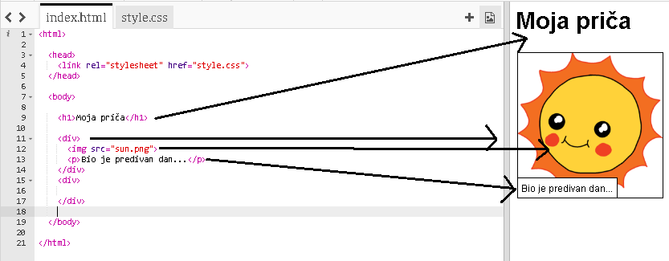
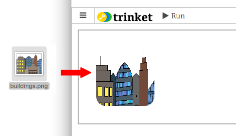

---
title: Ispričaj priču
level: HTML & CSS 1
language: hr-HR
embeds: "*.png"
materials: ["Club Leader Resources/*.*","Project Resources/*.*"]
stylesheet: web
...

# Uvod { .intro}

U ovom projektu, naučit ćemo vas kako napraviti svoju vlastitu internet stranicu za pričanje priče, vica, pjesme.


# Korak 1: Odluči što pisati { .activity}

Prije nego što započneš s programiranjem, moraš odlučiti što pisati.

## Provjera aktivnosti{ .check}

+ Razmisli o priči koju želiš ispričati. To može biti:
	+ Poznata priča;
	+ Priča koju si izmislio;
	+ Nešto što se dogodilo tebi ili nekome koga poznaješ.

	Osim piče to može biti: Vic, pjesma, što god ti padne na pamet.

# Korak 2: Uređivanje priče { .activity}

Započnimo sa uređivanjem HTML sadržaja i CSS stila naše stranice.

## Provjera aktivnosti { .check}

+ Open this trinket: <a href="http://jumpto.cc/web-story" target="_blank">jumpto.cc/web-story</a>. Ako čitaš ovo na internetu, možeš se koristiti i drugim linkom ponuđenim ispod.

<div class="trinket">
	<iframe src="https://trinket.io/embed/html/8083cfebb3" width="100%" height="400" frameborder="0" marginwidth="0" marginheight="0" allowfullscreen>
	</iframe>
</div>

+ Možda se sjećate iz projekta 'Sretan rođendan' da se sadržaj internetske stranice piše u `<body>` HTML dokumenta.

	Idi do 7 reda u kodu, tu bi trebao naći sadržaj svoje internet stranice, koji je unutar `<body>` i `</body>` oznaka.

	

+ Možete li reći koje oznake se koriste za kreiranje različitih dijelova stranice?

	

	+ `<h1>` je  __heading(naslov)__. Možeš koristiti brojeve od 1 do 6 za promjenu veličine naslova;
	+ `<div>` je skraćeno od __division(pregrada)__, i to je način grupiranja stvari zajedno. U ovoj internetskoj stranici, koristit ćeš je da je grupiraš zajedno.
	+ `<p>` je __paragraph(paragraf)__ teksta.

##Izazov: Napravi neke izmjene {.challenge}
Uredi HTML i CSS kod da prilagodiš svoju internetsku stranicu.


Možeš mijenjati boje koristeći internetsku stranicu, i možeš također koristiti fontove kao <span style="font-family: Arial;">Arial</span>, <span style="font-family: Comic Sans MS;">Comic Sans MS</span>, <span style="font-family: Impact;">Impact</span> and <span style="font-family: Tahoma;">Tahoma</span>.

Ako trebaš više pomoći, možeš koristiti projekt 'Sretan rođendan' da ti pomogne.

## Spasi svoj projekt {.save}

# Korak 3: Pričanje priče { .activity}

Dodajmo drugi dio priče.

## Provjera aktivnosti { .check}

+ Idi na redak 17 koda, i dodaj drugi komplet od `<div>` and `</div>` početka i kraja oznaka. Ovo će stvoriti novu datoteku za slijedeći dio tvoje priče.

	

+ Dodaj paragraf teksta unutar svoje nove `<div>` oznake.

	

+ Napokon, možeš dodati sliku u svoju datoteku, dodavanjem ovog koda unutar svoje `<div>` oznake:

	```
	
	```

	Primjeti da `` oznake su malo drukčije od drugih oznaka, jer one nemaju krajnu oznaku.

+ Za HTML slike, trebaš dodati __source(izvor)__ slike, unutar govorne oznake. Pronađimo sliku koju ćemo dodati tvojoj priči.

	Idi do <a href="http://jumpto.cc/web-images" target="_blank">jumpto.cc/web-images</a>, i pronađi sliku koju želiš uključiti u svoju priču.

+ Pritisni desnim klikom miša na sliku, i pritisni 'Copy image URL(Kopiraj sliku URL)'. URL je adresa slike.

	

+ Zalijepi URL između govornih oznaka u svojoj `` oznaki. Trebao bi vidjeti pojavljivanje svoje slike!

	

+ __If you have Trinket account(Ako imaš Trinket račun)__, možeš također zapamtiti svoju sliku na svoju internetsku stranicu! Da napraviš to, pritisni ikonu slike na vrhu svojeg trinketa i pritisni 'upload(zapamti)'.

	

+ Pronađi svoju sliku na monitoru, i povuci je unutar svog trinketa.

	

+ Onda možeš samo dodati ime svoje nove slike između govornih oznaka u svom `` oznaci, kao ovo:

	```
	
	```

## Zapamti svoj projekt {.save}

##Challenge: Keep going! {.challenge}
Koristi ono što si naučio u ovom projektu da žavršiš govrenje svoje priče! Ovdje je primjer:


## Zapamti projekt {.save}