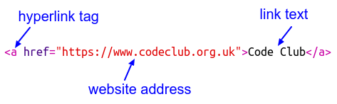
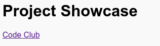

---
title: Projekt prikaz slučajeva
level: HTML & CSS 1
language:hr-HR
embeds: "*.png"
materials: ["Club Leader Resources/*.*","Project Resources/*.*"]
stylesheet: web
...

# Uvod {.activity}

U ovom projektu, napravit ćeš prikaz slučajeva HTML projekta i naučiti nešto o linkovima i ugrađivanju izvora. 

# Korak 1: Dodavanje poveznica na web stranice {.activity}

Tekstualne poveznice nam omogućuju da kliknemo na riječi koje nas vode na drugu web stranicu, te riječi su obično podvučene.

## Lista aktivnosti { .check}

+ Otvori ovaj trinket: <a href="https://trinket.io/html/9ad31460f0">https://trinket.io/html/9ad31460f0</a>. Ako čitaš ovo online onda je to poveznica, također možeš koristiti ugrađeni trinket ispod. 

  <iframe src="https://trinket.io/embed/html/9ad31460f0" width="100%" height="400" frameborder="0" marginwidth="0" marginheight="0" allowfullscreen>
  </iframe>

+ HTML koristi `<a>` oznaku za poveznice. 

+ Pronađi `<a>` u svom projektu. 

+ Dodaj Code Club adresu web stranice <a href="https://www.codeclub.org.uk">`https://www.codeclub.org.uk`</a> i poveži tekst:

+ Klikni Run za ponovno testiranje trinketa.

+ Klikni na Code Club poveznicu za test stranice. Tvoj trinket će sada pokazati Code Club web stranice: 	

+ Za povratak  stranice možete: 

	+ Pokrenuti vaš trinket ponovno,

	+ Stisnuti povratnu tipku na tipkovnici, ili

	+ Desni klik i izabrati povratak. 

## Lista aktivnosti { .check}

+ sada postavite poveznicu u rečenici unutar odlomaka

testiraj svoju web stranicu. 

## Izazov: dodaj drugu poveznicu {.challenge}

dodajte rečenicu sa poveznicom web stranice koja se koristi za stvaranje web projekata. na primjer: <a href="https://trinket.io">https://trinket.io</a> ili <a href="http://colours.neilorangepeel.com">http://colours.neilorangepeel.com</a>.

# Spremi projekt{.activity}

# korak 2: poveznica za Trinket {.activity}

možete povezati web stranice sa trinketom. 

## lista aktivnosti { .check}

+ Jesi li spremio/la poveznicu sa Happy Birthday trinketom? Ako jesi onda otvori taj trinket u drugom pregledničko prozoru. U suprotnom otvori završeni primjer trinketa: <a href="https://trinket.io/html/e996dc0380">https://trinket.io/html/e996dc0380</a>

+ Klikni na Podijeli meni iznad svog trinketa i izaberi poveznicu:

Ako si otvorio trinket sa svog korisničkog računa onda potraži opciju Podijeli ispod svog trinketa:

+ odaberi 'Pokaži samo kod ili rezultat (let users toggle between them)' i kopiraj poveznicu u trinket. 

+ Idi nazad u projekt Showcase trinket  i dodaj `<h2>` zaglavlje i poveznicu sa Happy Birthday projektom.

Testiraj svoju webstranicu, trebala bi izgledati od prilike ovako:

Klikni na Happy Birthday poveznicu i testiraj vodi li te na na tvoj trinket.

## Spremi projekt {.save}

## Izazov: Kreiraj listu svojih projekta {.challenge}

Dodaj neke od drugih HTML &amp; CSS projekata koje si kreirao na Code Club. Koristi `<h2>` zaglavlja za organizaciju web stranice. 

Ako nemaš poveznica sa drugim projektima koje si kreirao onda možeš koristiti Code Club primjerke:

+ sretan rođendan: <a href="https://trinket.io/html/e996dc0380">https://trinket.io/html/e996dc0380</a>

+ Ispričaj priču: <a href="https://trinket.io/html/c8afdef912">https://trinket.io/html/c8afdef912</a>

+ Tražen: <a href="https://trinket.io/html/ebeb56398a">https://trinket.io/html/ebeb56398a</a>

+ Recept: <a href="https://trinket.io/html/c0fd9b40cd">https://trinket.io/html/c0fd9b40cd</a>

+ Mistično pismo: <a href="https://trinket.io/html/1d4d4c5ce1">https://trinket.io/html/1d4d4c5ce1</a>

Tvoja završena stranica bi trebala izgledati ovako:

## Spremi projekt {.save}

# korak 3: Povezivanje projekata {.activity}

Kao što možemo povezivati sa trinketom kao webstranica također možemo ugraditi u webstranicu.

## Lista aktivnosti { .check}

+ Možda bi bilo bolje da pokušaš raditi u Fullscreen način tako da imaš više mjesta:

Pritisni Esc za izlaz Fullscreen način.

+ Pokreni trinket i klikni na sretan rođendan poveznicu. 

+ Klikni na trinket meni i izaberi __embed__. Ako nisi u Fullscreen načinu možda ćeš morati pomicati prema dolje. Koristi traku za pomicanje sa desna ili strelicom prema dolje na tipkovnici.

## Lista aktivnosti { .check}

+ Izaberi 'Prikaži samo kod ili rezultat (let users toggle between them)' i __kopiraj__ugrađeni kod za trinket. 

+ Trinket je kreirao HTML za tebe da ugradiš u web stranicu. On koristi `<iframe>` oznaku koja dopušta sadržaju da se ugradi u stranicu. 

+ Sada zalijepi taj kod ispod poveznice Happy Birthday trinketa:

+ Pokreni trinket da ga testiraš i sada bi trebao vidjeti projekt Happy Birthday ugrađen u web stranicu. 

+ Postoji šansa da se dno trinketa ne prikaže. To možeš popraviti tako da promjeniš vrijednost visine na`<iframe>`. 

Postavi visinu na __400__. Ako si napravio promjene u Happy Birthday projektu možda ćeš morati izabrati drugu vrijednost. 

## Snimi projekt {.save}

## Izazov: Ugradi još projekata {.challenge}

Ugradi još svojih projekata u Showcase. Sjeti se da ih možeš lako nači njihove trinket stranice klikom na vezu u web stranici. 

# Korak 4: Kreiraj Table of Contents {.activity}

Idemo dodat Table of Contents kako bi mogli lakše doći do određenog projekta. 

## Lista aktivnosti { .check}

+ Jednako kako se možemo povezivati sa ostalim webstranicama, možemo se povezati sa dijelovima webstranice ako im postavimo id. 

Dodaj id na `<h2>` zaglavlje od Happy Birthday projekta:

+ Dodaj ids na svaki od svojih projekta i dodaj im kratka imena : prića, tražen, recept and pismo. 

+ Možeš se povezati sa elementom pomoću id-a tako da staviš ljestve ‘#’ simbol ispred njegovog imena. Npr. `#birthday`. 

Kreiraj poredanu listu veza svojih projekata. (Poredane liste su ubačene u Recepie Projekt.)

+ Pokreni projekt i testiraj ga tako da klikneš na poveznice da odeš na svoje projekte. 

## Spremi projekt {.save}

# Korak 4: Povratak na vrh {.activity}

## Lista aktivnosti { .check}

+ Vrlo je korisna opcija kojom se možemo vratiti na vrh stranice. HTML ima `#top` za tu radnju. 

+ Dodaj vezu na `#top` nakon svakog ugrađenog projekta u svojoj webstranici:

+ Testiraj veze tako da klikneš na Top kako bi se vratio na vrh webstranice. 

## Spremi projekt {.save}

## Izazov: Unaprijedi svoj Showcase {.challenge}

Koristeči se CSS-om naučio/la si kako napraviti stranicu zanimljivijom. Probaj promjeniti boju pozadine na webstranici ili font korišten za zaglavlje. 

Također možeš dodati neke informacije o svakom projektu i što ti se svidjelo kod izrade. 

## Izazov: Kreiraj novi Showcase {.challenge}

Trinketi nisu jedine stvari koje ugrađuješ u webstranicu. Također možeš ugraditi video, widgete(kao na primjer vremenski widget).

Otvori ugrađeni Scratch Example trinket i pokreni ga: <a href="https://trinket.io/html/9f7212b8fe">https://trinket.io/html/9f7212b8fe</a>

Idi na Scratch web stranicu i pronađi projekt koji ti se sviđa. Može biti jedan od tvojih  ili neki koji si pronašao.

Ako si prijavljen možeš kliknuti 'Embed' gumb ispod projekta kako bi dobio HTML ugrađeni kod. 

Ako nisi prijavljen onda potraži Scratch projekt broj na njgovoj webstranici. 

kreiraj kopiju `<iframe>` koda u Scratch Embed example i promijeni broj projekta u jedan od projekta koje želiš ugraditi:

## Snimi projekt {.save}
