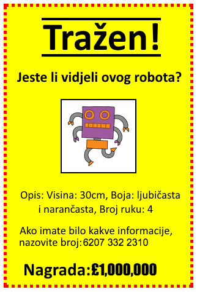
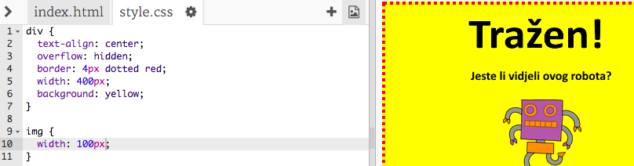
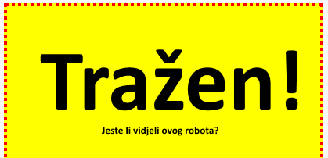
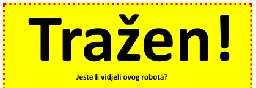

---
title: Tražen!
level: HTML & CSS 1
language: hr-HR
embeds: "*.png"
materials: ["Club Leader Resources/*.*","Project Resources/*.*"]
stylesheet: web
...

# Uvod { .intro}

U ovom projektu, naučit ćemo kako da napravimo naš vlastiti poster.



# 1. Korak : Uređivanje našeg postera { .activity}

Započnimo uređivanjem CSS koda za poster.

## Provjera aktivnosti { .check}

+ Otvorite ovaj Trinket: <a href="http://jumpto.cc/web-wanted" target="_blank">jumpto.cc/web-wanted</a>. Ako čitate ovo preko interneta, također možete koristiti ugrađenu verziju ovog Trinketa.

<div class="trinket">
	<iframe src="https://trinket.io/embed/html/58318bee1f" width="100%" height="550" frameborder="0" marginwidth="0" marginheight="0" allowfullscreen>
	</iframe>
</div>

+ Mišem kliknite na "style.css" karticu. Primjetit ćete da već postoje neka CSS svojstva za `div` koji sadrže različite dijelove postera.

	```
	div {
		text-align: center;
	    overflow: hidden;
	    border: 2px solid black;
	    width: 300px;
    }	
	```

+ Započnimo s izmjenjivanjem `text-align` svojstva:

	```
	text-align: center;
	```
	
	Što će se dogoditi kada promjenite riječ s `center` na `left` ili `right`?

+ Šta s `border` svojstvom?

	```
	border: 2px solid black;
	```

	`2px` u kodu iznad znači 2 pixela. Šta se dogodi kada promijenite s `2px solid black` na `4px dotted red`?

+ Promijenite `width` postera na `400px`. Što se dogodilo s posterom?

+ Sada ćemo napraviti CSS da promijeni boju pozadine postera. Idite na kraj 5. reda svog koda i pritisnite enter, sada ćete imati novi prazan red.

	

	Napišite sljedeći kod u novom redu:

	```
	background: yellow;
	```

	Provjerite dali ste napisali kod _isto_ kao iznad. Primjetit ćete da da je pozadina `<div>` sada žuta.

	

##Izazov: Poboljšaj svoj poster {.challenge}
Dodajte sljedeće CSS svojstvo svom `div` stilu:

```
border-radius: 40px;
```

Što radi ovo svojstvo? Što će se dogoditi ako promjenite broj u kodu iznad?

## Spremite svoj projekt {.save}

# 2. Korak: Uređivanje slika { .activity}

Sada ćemo poboljšati izgled ove slike.

## Provjera aktivnosti { .check}

+ Trenutačno, nema nijednog CSS svojstva za naš `` oznaku, ajmo sad dodati neke!

	Prvo, dodajmo sljedeći kod ispod CSS za naš div:

	```
	img {

	}
	```

	

+ Možemo dodati CSS svojstva za slike između `{` i `}` vitičastih zagrada.

	Naprimjer, dodajte ovaj kod između vitičastih zagrada da bi odredili širinu slike:

	```
	width: 100px;
	```

	Vidjet ćete da se veličina slike promijenila, sada je njezina širina 100 pixela.

	

+ Možete dodati obrub oko slike s ovim kodom:

	```
	border: 1px solid black;
	```

+ Jeste li primjetili da nema puno mjesta između slike i obruba?

	

	Ovo možemo popraviti dodavajući padding oko slike:

	```
	padding: 10px;
	```

	Padding je prostor između sadržaja (u ovom slučaju slike) i njegovog obruba.

	

	Što misliš da će se dogoditi ako promjenimo padding na `50px`?

##Izazov: Poboljšavanje naše slike {.challenge}
Možemo li postaviti boju pozadine naše slike? Ili zaobljeni obrub?

## Spremite svoj projekt {.save}

# 3. Korak: Uređivanje naslova { .activity .new-page }

Sada ćemo poboljšati izgled `<h1>` naslova.

## Provjera aktivnosti { .check}

+ Dodajte sljedeći kod ispod CSS-a slike:

	```
	h1 {

	}
	```

	Ovo je gdje ćete dodati CSS svojstva za naš glavni `<h1>` naslov.

+ Da biste promijenili font `<h1>` naslova, dodajte sljedeći kod između vitičastih zagrada:

	```
	font-family: Impact;
	```

+ Također možete promijeniti veličinu naslova:

	```
	font-size: 50pt;
	```

+ 	Jeste li primjetili da postoji veliki razmak između `<h1>` naslova i elemenata oko njega?

	

	To se događa zato što postoji margina oko naslova. Margina je razmak između elemenata (u ovom slučaju naslova) i ostalih stvari oko njega.

	Možete napraviti marginu manju s ovim kodom:

	```
	margin: 10px;
	```

	

+ Također možete podcrtati svoj naslov:

	```
	text-decoration: underline;
	```

##Izazov: Napravite svoj poster zakon! {.challenge}
Dodajte više CSS koda da biste uredili `<h3>` naslov i svoje paragrafe. 


Ovo je lista CSS svojstava koje možete koristiti:

```
color: black;
background: white;
font-family: Arial / Comic Sans MS / Courier / Impact / Tahoma;
font-size: 12pt;
font-weight: bold;
text-decoration: underline overline line-through;
margin: 10px;
padding: 10px;
width: 100px;
height: 100px;
```

## Spremite svoj projekt {.save}

##Izazov: Reklamirajte događaj! {.challenge}
Možete li napraviti poster za neki događaj u vašoj školi? To može biti igrokaz, sportski događaj, ili čak poster koji reklamira vaš Kod Klub!

## Spremite svoj projekt {.save}