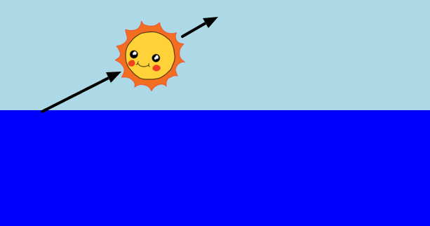

---
title: Izlazak sunca
level: HTML & CSS 2
language: hr-HR
embeds: "*.png"
materials: ["Club Leader Resources/*.*","Project Resources/*.*"]
stylesheet: web
...

# Uvod { .intro}

U ovom projektu naučiti ćete kako stvoriti animaciju izlaska sunca u CSS-u.

<div class="trinket">
  <iframe src="https://trinket.io/embed/html/abcc0284a3?outputOnly=true&start=result" width="600" height="400" frameborder="0" marginwidth="0" marginheight="0" allowfullscreen>
  </iframe>
  
</div>

# 1. Korak: Stvaranje sunca { .activity}

Započnimo s dodavanjem slike za sunce i namjestimo ga pomoću CSS-a.

## Zadaci { .check}

+ Otvorite ovaj trinket: <a href="http://jumpto.cc/web-sunrise" target="_blank">jumpto.cc/web-sunrise</a>. Ako čitate ovo preko interneta, također možete koristiti ugrađenu verziju ovog Trinketa.


<div class="trinket">
  <iframe src="https://trinket.io/embed/html/5085f92143" width="100%" height="400" frameborder="0" marginwidth="0" marginheight="0" allowfullscreen>
  </iframe>
</div>

+ Pogledajte unutar `body` vaše `index.html` datoteke i pronaći ćete `div` elemente za more i nebo.

    ```
    <div id="nebo">
    </div>
    
    <div id="more">
    </div>
    ```

+ Slika za sunce je već ukljućena u vašem projktu. 

    Dodajte sliku unutar vašeg sunce `div` uključujući id da bi mogao uređivati s njim:

    

+ Jao, slika je ogromna. Idite na `style.css` i dodajte CSS da bi odredili visinu slike:

    

    Zapamtite da se širina automatski ažurira kako bi proporcije ostale iste. 

+ Konačno, dodajmo kod kako bi pozicionirali sunce:

    


## Spremite svoj projekt {.save}

# 2. Korak: Animiranje izlaska sunca { .activity}

Da bi animirao svoj izlazak sunca, trebate definirati kako se sunce kreće i koliko će mu biti potrbno da izađe.

Kako biste učinili ovo trebate definirati listu __key frames__. Svaki key frame definira CSS svojstva elementa u određenom trenutku u animaciji. 

## Zadaci  { .check}

+ Prvo, trebat ćete koristiti `@keyframes` da napravite novu animaciju nazvanu izlazak sunca. 

    Dodajte ovaj CSS kod na kraj svoje `style.css` datoteke:

    ```
    @keyframes sunrise {
        0% {top: 90%;}
        100% {top: 0;}
    }
    ```

    Ovaj kod određuje gdje će se sunce pozicionirati na početku (`0%`) i kraju (`100%`) animacije.

    Zato što je sunce unutar nebo `div` i `top` i `left` pozicije koje postavite su unutar neba s `top: 100%` donji do neba, a ne donji dio web stranice.


+ SAda kad ste stvorili `sunrise` animaciju, samo trebate postaviti sunce! 

    Dodajte istaknuti kod sunce CSS-u:

    

   To naređuje suncu da provede 10 sekundi animirajući izlazak sunca.

+ Da bi ponovo pokrenuli animaciju u Trinketu, samo kliknite **Autorun**. 

## Spremite svoj projekt {.save}

##Izazov: Dijagonalna animacija {.challenge}
Možete te li dodati kod vašoj `sunrise` animaciji, Kako bi sunce započelo u donjem lijevom dijelu neba i kretalo se dijagonalno do svoje pozicije u gornjem dijelu centra?

Možete koristiti `left` svojstvo da biste to učinili, naprimjer:

```
left: 40%;
```



## Spremite svoj projekt {.save}


# 3. Korak: Animacija bez kraja { .activity}

Napravite animaciju koja će se beskonačno ponavljati.

## Zadaci { .check}

+ Ako želite da sunce izađe pa zađe. Samo dodajte još keyframe-a vašoj animaciji.

    ```
    @keyframes sunrise {
        0%   {top:90%; left:0;}
        33%  {top:0; left:40%; }
        66%  {top:0; left:40%; }
        100% {top:90%; left:80%; }
    }
    ```

    Ovo znači da animacija započinje i završava na dnu neba i ostaje na vrhu od 33% do 66% animacije.

+ Sada samo trebate dodati `infinite` u `#sun` animaciju kako bi napravili da se ponavalja beskonačno:

    

+ Testirajte svoju animaciju. Da li sunce izlazi i zalazi? 


## Spremite svoj projekt {.save}

# 4. Korak: Animiranje neba { .activity}

Animacija nije samo za kretanje. Animirajte nebo tako da postaje tamnije po noći.

## Zadaci { .check}

+ Dodajte animaciju zvanu `sky` vašem CSS-u:

    ```
    @keyframes sky {
        0% {background: black}
        100% {background: lightblue}
    }
    ```

    Primjetite da sada animirate boju neba, a ne poziciju.

+ Dodajte kod vašem nebu da bi mu naredili da koristi novu animaciju:

    ```
    animation: sky 10s;
    ```

    

+ Pokrenite **Autorun** da biste testirali vašu animaciju. 

## Spremite svoj projekt {.save}

##Izazov: Poboljšajte nebo {.challenge}

Možete li promjeniti animciju neba tako da se podudara sa suncem i ostaje plavo tjekom dana i postaje tamno dok sunce zalazi. Napravite da se ponavlja beskonačno. 


##Izazov: Više animacija {.challenge}

Možete li animirati drugu sliku? Možete animirati poziciju, boju, oblik, veličinu, prozirnost ili bilo čega se sjetite. Pokušaje promjeniti trajanje vaše animacije.

+ Uključite je u svoj HTML s id-om
+ Uredite id
+ Stvorite @keyframes pravilo
+ Koristite `animation:` da biste pokrenuli animaciju koju ste definirali s @keyframes 

Kliknite na ikonu slike da biste vidjeli slike korištene u projektu.:


Možete također prenjeti svoje slike ako želite. 

Ne zaboravite da možete stavljati elemente u more kao i u nebo:


U ovom primjeru duga koristi prozirnost opacity za efekt nestajanja:

```
@keyframes fade {
  0%   {opacity: 0;}
  50%  {opacity: 100;}
  66%  {opacity: 0;}
  100%   {opacity: 0;}
}
```

Brod koristi negativni početni položaj tako da ga nemožete vidjeti tijekom djela animacije:

```
 @keyframes left-right {
  0%    {left:-50%;}
  100%  {left:200%;}
}
```

## Spremite svoj projekt {.save}
