---
title: Povezane Sobe
level: HTML & CSS 2
language: hr-HR
embeds: "*.png"
materials: ["Club Leader Resources/*.*","Project Resources/*.*"]
stylesheet: web
...

# Uvod {.intro}

U ovom projektu, napraviti ćete niz povezanih soba, gdje je svaka soba drugačija web stranica koju možete uređivati pomoću HTML-a. 

  <iframe src="https://trinket.io/embed/html/ba5d27ec68?outputOnly=true&start=result" width="600" height="450" frameborder="0" marginwidth="0" marginheight="0" allowfullscreen>
  </iframe>
  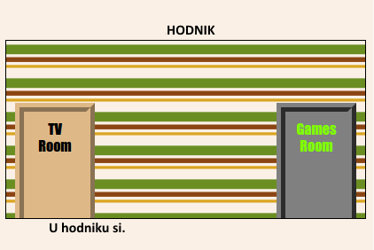

__Upute__: Stisnite na vrata da bi mijenjali sobe.

# 1. Korak: Povezivanje na drugu web stranicu u istom projektu. {.activity}

Web projekti mogu biti napravljeni od mnogo HTML povezanih datoteka.
## Provjera Aktivnosti { .check}

+ Otvorite ovaj trinket: <a href="http://jumpto.cc/web-rooms" target="_blank">jumpto.cc/web-rooms</a>. Ako čitaš ovo online, također možeš koristiti ugrađeni trinket ispod. 

  <iframe src="https://trinket.io/embed/html/ef608f0733" width="100%" height="400" frameborder="0" marginwidth="0" marginheight="0" allowfullscreen>
  </iframe>

+ Trinket bi se trebao sam pokrenuti i pronaći ćete se u Hodniku.:

	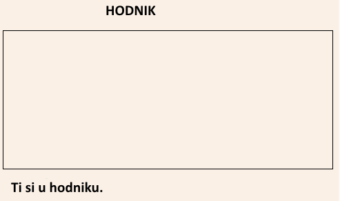

+ Pogledaj popis kartica od datoteka za ovaj trinket. Možete li vidjeti  `tvroom.html`? Stisnite na to.

	

	To je druga html datoteka u istom projektu. 

+ Da bi došli do `tvroom.html` morate dodati poveznica(link) u `index.html`. 

	Dodaj označeni kod unutar `
` s klasom `room`: 

	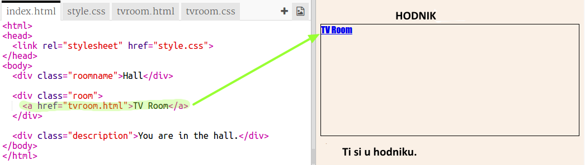

+ Isprobaj svoj trinket klikom na __TV Room__ poveznicu(link) da biste vidjeli `tvroom.html` web stranicu.

	Primjetite da `tvroom.html` također ima svoju `tvroom.css` stil datoteku koja određuje izgled ove stranice. 

	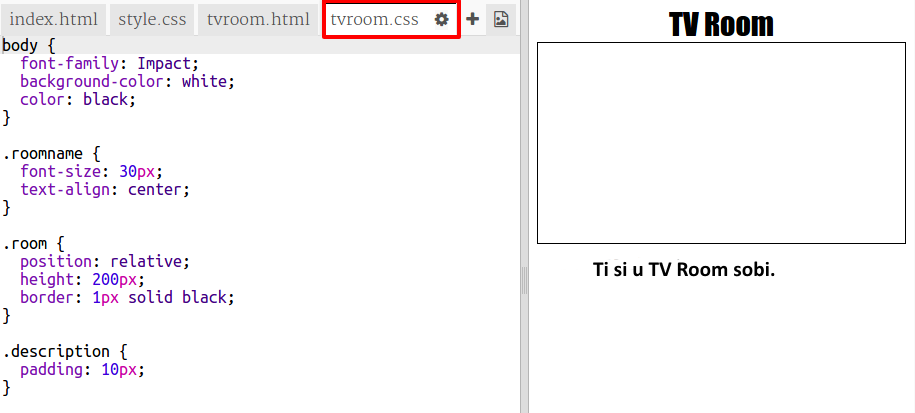

	
##Izazov: Dodajte drugu poveznicu(link) {.challenge}

Dodajte `<a>` poveznicu u `tvroom.html` web stranicu da biste dosli nazad do Hodnik web stranice koja se zove `index.html`. Tekst poveznice bi trebao biti 'Hall'.

 TV Soba web stranica bi trebala imati poveznicu(link) koja se može stisnuti, npr. :

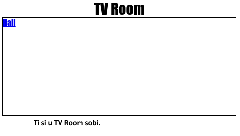

Budite sigurni da ste provjerili kod. Klikom na poveznice bi se trebali pomicati iz Hodnika u TV Sobu i nazad.

## Snimite svoj projekt {.save}

# Korak 2: Dodaj drugu sobu {.activity}

Sad ćemo dodati drugu sobu,  __Games Room__. 

+ Kliknite na __+__ gumb da bi ste dodali stranicu :

	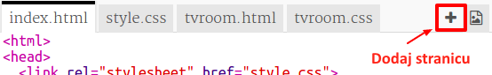

	Upišite `gamesroom.html` za naziv stranice:

  	

+ HTML za __Games Room__ je dosta sličan `tvroom.html` pa __kopiraj__ to i __zalijepi__ u `gamesroom.html`.
	
	Uredi označene predmete tako da piše Games umjesto TV:

		

+ Vaš `gamesroom.html` sada koristi `gamesroom.css` koji još ne postoji. 

	Napravi `gamesroom.css` klikom na __+__ gumb. 

+ CSS za __Games Room__ je jako sličan `tvroom.css` pa __kopiraj__ to i __zalijepi__ u `gamesroom.css`.

	

+ Dodaj poveznicu iz Hall u Games room:

	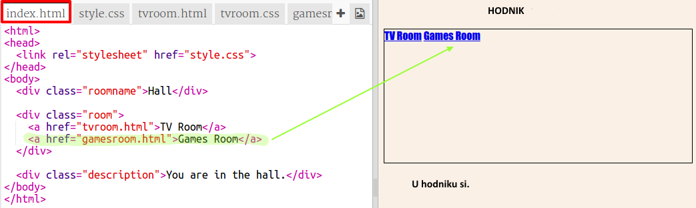

+ Testiraj svoj projekt klikom na Games Room poveznicu

	__Games Room__ bi trebao ovako izgledati:

	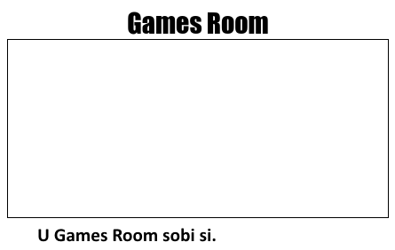

	Nije jako uzbudljivo, ali to možeš popraviti u idućem izazovu. 

## Spremi svoj projekt {.save}

##Izazov: Uredi i poveži Games Room {.challenge}

Uredi HTML i CSS za __Games Room__ tako da web-stranica izgleda ovako: 

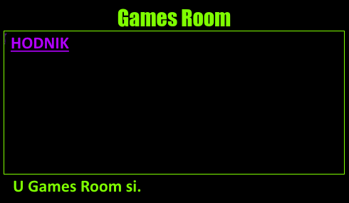

Pomoć: Morat ćeš promijeniti boju pozadine, boju slova i boju obruba u `gamesroom.css`. Svijetlo zelena se naziva `chartreuse`.  

Pomoć: Morat ćeš dodati `<a>` poveznicu u `gamesroom.html` koji vodi u `hall.html`.

## Spremi svoj projekt {.save}

# Treći korak: Napravi poveznice da izgledaju kao vrata {.activity}

Poveznice ne moraju biti samo tekstovi. Napraviti ćemo vrata koja se mogu kliknuti `
`.

## Provjera aktivnosti { .check}

+ Otvori `index.html` i dodaj `
` oko __TV Room__ poveznice teksta. Mora biti unutar `<a>` da se može kliknuti.

  Dodaj `id="hall2tv"` da ga označiš kao vrata od Hall do TV Room tako da možeš urediti vrata. 

    

+ Klikom na `style.css` kartica, idi do kraja i dodaj sljedeći CSS da bi promjenio boju i veličinu vrata:

	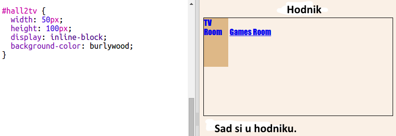

+ Testiraj svoju web-stranicu klikom na vrata, ne samo na tekst.

+ Da bi više izgledalo kao vrata, dodat ćemo obrub sa tri strane.

	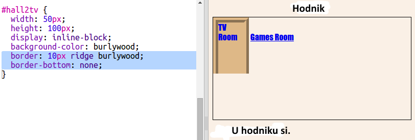

+ Dodat ćemo CSS da bi tekst na vratima izgledao bolje.

	

+ Vjerojatno ste primjetili da vrata lebde.To ćemo popraviti tako da vrata premjestimo unutar sobe.

	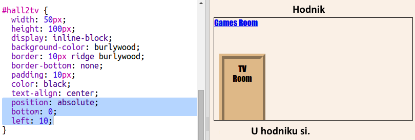	

+ Testiraj svoju web-stranicu klikom na vrata da bi došao do __TV Room__.

## Spremi svoj projekt {.save}

##Izazov: Dodaj još vrata! {.challenge}

Pretvori ostale poveznice u projektu u vrata na isti način. 

Za svaka vrata ćeš morati:

+ Urediti poveznicu vrata da bi koristili `
` s id-om  kao što je`hall2games` da bi ga mogli urediti. 

	Na primjer: 

	`<a href="gamesroom.html">
Games Room
</a>`

+ Dodaj CSS za id vrata u `.css` datoteku za svoju sobu. Koristi _kopiraj_ i _zaplijepi_ da bi uštedio vrijeme. Svaka vrata možeš urediti drugačije, ako želiš. 

+ Promjeni mjesto vrata koristeći `bottom:` i `left:` ili `right:`.

Hall bi mogao izgledati ovako:

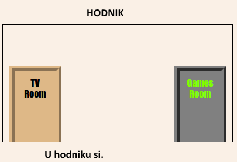

TV Room bi trebao izgledati ovako:

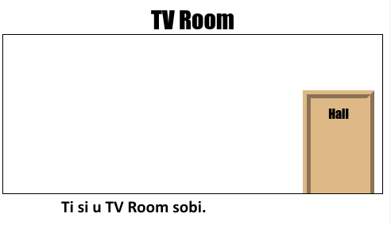	

# Četvrti korak: Dodavanje slike pozadine {.activity}

Uredit ćemo Hall pomoću slike pozadine.

## Provjera aktivnosti { .check}

+  Uredi `style.css` da bi dodao sliku pozadine Hall-a:

	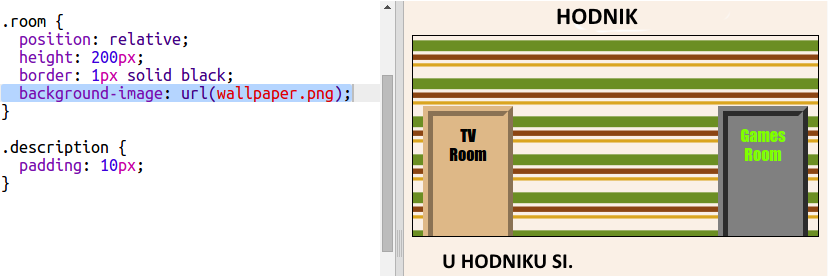	

	Slika će se ponoviti da bi popunila sobu. 

## Snimi svoj projekt {.save}

##Izazov: Dodaj pozadinsku sliku u Games Room {.challenge}

Možeš li urediti games room s pozadinskom slikom?

Možeš koristiti `space-invader.png` pozadnisku sliku koju sadrži tvoj projekt. 

Trebat ćeš:

+ Dodati `background-image:` u `.room` CSS za Games Room. 

Uređena soba bi trebala ovako izgledati:

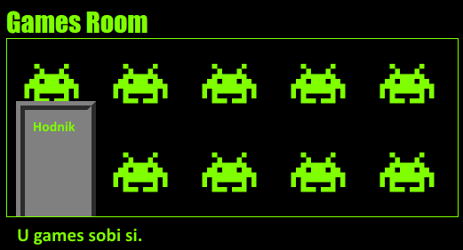	

## Snimi svoj projekt {.save}

##Izazov: Načini je svojom! {.challenge}

Dodaj još soba u svoj projekt. Prisjeti se da možeš koristiti __kopiraj__ i __zalijepi__ da bi uštedio vrijeme i onda samo promjeni stvari koje trebaju biti drugačije. 

Za svaku sobu ćeš trebati:

+ Napraviti `.html` datoteku
+ Dodati poveznice za vrata u i iz nove 'sobe'
+ Napraviti `.css` datoteku sa stilom za svoju novu sobu i njezina vrata 

Možeš promjeniti `background-color:` za svaku sobu. Klikni na ikonu da bi vidio pozadinske slike od kojih možeš birati:

	

## Spremi svoj projekt {.save}

