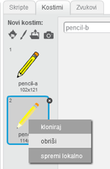
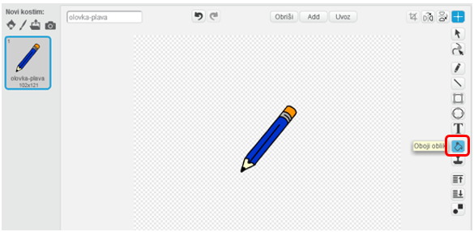
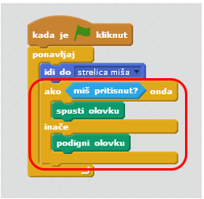
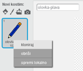
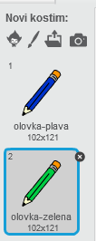
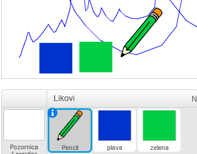
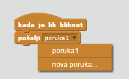
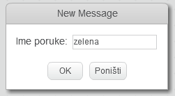
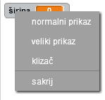
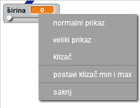

---
title: Program za bojanje
level: Scratch 1
language: hr-HR
stylesheet: scratch
embeds: "*.png"
materials: ["Club Leader Resources/*","Project Resources/*"]
...

# Uvod { .intro }

U ovom ćeš projektu izraditi vlastiti program za bojanje!

<div class="scratch-preview">
  <iframe allowtransparency="true" width="485" height="402" src="http://scratch.mit.edu/projects/embed/63473366/?autostart=false" frameborder="0"></iframe>
  
</div>

# Korak 1: Izrada olovke { .activity }

Počnimo izradom olovke koju ćemo kasnije koristiti za crtanje na pozornici.

## Zadatci { .check }

+ Otvori novi Scratch projekt i obriši mačku tako da dobiješ prazan projekt. Online Scratch program nalazi se na adresi <a href="http://jumpto.cc/scratch-new">jumpto.cc/scratch-new</a>.

+ Dodaj lik olovke u projekt.

	 

+ Odaberi karticu 'Kostimi' i obriši kostim 'pencil-b'.

	 

+ Preimenuj kostim u 'olovka-plava', odaberi alat 'Oboji oblik' i obojaj olovku u plavu boju. 

	 

+ Kako ćemo za crtanje koristiti miša, potrebno je isprogramirati olovku da slijedi kretanje strelice miša. Za to ćemo koristiti blok  `ponavljaj` {.blockcontrol}. Dodaj ove naredbe liku olovke:

	```blocks
	kada je ⚑ kliknut
	ponavljaj
	   idi do [strelica miša v]
	end
	```

+ Isprobaj program. Klikni zastavicu i pomiči miša po pozornici. Radi li kako smo zamislili? 

+ Primjećuješ li da strelicu miša prati centar olovke, a ne njezin vrh? 

	

	To ćemo popraviti tako da klikneš na kostim olovke 'olovka-plava' i zatim na alat 'Postavi centar kostima'.

	

+ Primjeti da se na kostimu pojavio križ. Sada klikni malo ispod vrha olovke da postaviš centar kostima.

	

+ Odaberi karticu 'Scripte' i provjeri još jednom svoj program - radi li sada bolje nego ranije?

+ Isprogramirajmo sada olovku tako da ona crta `ako` {.blockcontrol} je tipka miša pritisnuta. Dodaj u program sljedeće naredbe: 

		

+ Isprobaj ponovo program. Ovaj puta pomiči olovku po pozornici i drži pritisnutu lijevu tipku miša. Crtaš li?

	

## Spremi projekt { .save }

# Korak 2: Bojice { .activity }

Dodajmo sada olovke različitih boja u projekt i dopustimo korisniku da odabere onu koju želi!

## Zadatci { .check }

+ Klikni na olovku, odaberi karticu 'Kostimi' i kloniraj  kostim 'olovka-plava'.

	

+ Preimenuj novi kostim u 'olovka-zelena' i obojaj olovku u zelenu boju.

	

+ Izradi dva nova lika koja ćeš koristiti za odabir boje.

	

+ Kada je odabrana zelena ikona `pošalji` {.blockevents} poruku liku olovke da promjeni kostim.

	Da to napraviš, najprije dodaj sljedeće naredbe zelenoj ikoni:

	```blocks
		kada je lik kliknut
pošalji [green v]
	```

	Za promjenu početne poruke klikni strelicu prema dolje u bloku `pošalji` {.blockevents} i odaberi 'nova poruka...'.

	

	Utipkaj tekst 'zelena'.

	

+ Sada treba reći olovci što da radi kada primi poruku. Dodaj olovci sljedeće naredbe:

	```blocks
		kada primim [zelena v]
promijeni kostim u [olovka-zelena v]
postavi boju olovke na [#00ff00]
	```

	Da bi postavili da bojica piše zelenom bojom potrebno je kliknuti na obojano polje u bloku `postavi boju olovke na {.blockpen} i kliknuti na zelenu ikonu.

+ Ponovi sada sve ovo za plavu olovku. Dodaj ove naredbe plavoj ikoni: 

	```blocks
		kada je lik kliknut
pošalji [plava v]
	```

	...i dodaj ove naredbe liku olovke:

	```blocks
		kada primim [plava v]
promijeni kostim u [olovka-plava v]
postavi boju olovke na [#0000ff]
	```

+ Na kraju, potrebno je odrediti početni kostim i boju olovke, te očistiti zaslon kako bi dobili čistu pozadinu kada pokrenemo program. Dodaj ove naredbe na početak bloka `kada je zastavica kliknuta` {.blockevents} (prije petlje `ponavljaj` {.blockcontrol}):

	```blocks
		obriši
promijeni kostim u [olovka-plava v]
postavi boju olovke na [#0000ff]
	```

	Ako ti se više sviđa neka druga boja, postavi nju za početnu!

+ Pokreni i isprobaj program. Radi li zamjena bojica?

	

## Spremi promjene u projektu { .save }

# Korak 3: Pogreške { .activity .new-page }

Ponekad u crtanju pogriješimo, pa nam treba gumica. Dodajmo gumb za brisanje i gumicu u projekt. 

## Zadatci { .check }

+ Dodajmo gumb koj će očistiti pozornicu! Dodaj lik 'X-block' na pozornicu i obojaj ga crvenom bojom.

	

+ Novo dodanom liku dodaj naredbu za brisanje: 

	```blocks
		kada je lik kliknut
obriši
	```

	Primjeti da nije potrebno slati poruku za brisanje pozornice. Bilo koji lik može ju obrisati.

+ Možeš napraviti i gumicu. Ako ti je voditelj radionice dao pristup materijalima iz mape 'Resources', odaberi  click 'Učitaj lik iz datoteke' i dodaj sliku 'eraser.svg'.

	
	
	Nemaš li sliku eraser.svg jednostavno napravi bijelu olovku umjesto nje.

+ Gumicu dodaj pored zelene i plave ikone, kao novi lik za odabir. Pozornica sada treba izgledati ovako: 

	

+ Da bi se olovka zamijenila s gumicom dodaj sljedeće naredbe liku gumice:

	```blocks
		kada je lik kliknut
pošalji [gumica v]
	```
	
+ Kada olovka primi poruku, možeš kreirati gumicu tako što ćeš promijeniti kostim olovke i postavniti boju crtanja jednaku boji pozadine. 

	```blocks
		kada primim [gumica v]
promijeni kostim u [gumica v]
postavi boju olovke na [#FFFFFF]
	```

+ Isprobaj projekt i provjeri možeš li brisati. 

	

+ Postoji još jedan problem s olovkom - moguće je crtati bilo gdje na pozornici, uključujući i dio s ikonama za odabir. 

	

	Da bi to popravili, potrebno je reći olovci da crta samo ako je pritisnuta lijeva tipka miša _i_ ako je y-pozicija miša veća od -110 (`miš y`{.blocksensing}`> -110` {.blockoperators}). Promijeni naredbu olovke `ako ... onda` {.blockcontrol} tako da izgleda ovako:

	

+ Pokreni program i provjeri rezultat. Pokušaj crtati po dijelu s ikonama za odabir.

	

## Spremi promjene u projektu { .save }

# Korak 4: Promjena debljine linije { .activity .new-page }

Dopustimo korisniku da crta olovkama različitih debljina.

## Zadatci { .check }

+ Dodaj novu varijablu imena 'širina'. Trebaš li se podsjetiti kako se to radi, provjeri u projektu 'Istjerivači duhova'.

+ Dodaj ovu naredbu unutar petlje `ponavljaj` {.blockcontrol} u kôdu za olovku:

	```blocks
		postavi debljinu olovke na (width)
	```

	Debljina traga koji ostavlja olovka sada će biti postavljena na vrijednost spremljenu u varijablu 'širina'.

+ Vrijednost varijable 'širina' moguće je mijenjati i pomoću klizača. To ćeš postići tako da promijeniš izgled varijable u 'klizač' - klikni desnom tipkom miša na varijablu i iz padajućeg izbornika odaberi 'klizač'. 

	

	Sada možeš mijenjati vrijednost varijable pomicanjem klizača. 

	

+ Pokreni program i provjeri možeš li mijenjati debljinu olovke. 

	

	Želiš li, možeš postaviti najmanju i najveću dopuštenu vrijednost varijable 'širina'. To ćeš postići tako da klikneš desnom tipkom miša na klizač i iz izbornika kojeg dobiješ odabereš naredbu 'postavi klizač min i max'. Sada upiši najmanju i najveću vrijednost. Na primjer 1 i 20. 

	

	Nastavi s testiranjem varijable 'širina' sve dok ne budeš zadovoljan/zadovoljna.

## Spremi promjene u projektu { .save }

## Izazov: Prečaci { .challenge }
Možeš li kreirati tipkovničke prečace za naredbe? Na primjer:

+ p = Promijeni olovku u plavu
+ z = Promijeni olovku u zelenu
+ g = odaberi gumicu
+ o = obriši zaslon

Omogući korisniku da mijenja debljinu olovke strelicama!

## Spremi promjene u projektu { .save }

## Izazov: Više olovaka { .challenge }
Dodaj crvenu, žutu i crnu olovku u svoj program za crtanje. Sjeti se  dodati i tipkovničke kratice za nove boje. 

Nacrtaj sliku u svom novom programu za bojanje!


