---
title: Rock Bend
level: Scratch 1
language: hr-HR

stylesheet: scratch
embeds: "*.png"

materials: ["Club Leader Resources/*"]
...


# Uvod { .intro }

U ovom projektu naučiti ćeš kako programirati vlastite glazbene instrumente!

<div class="scratch-preview">
  <iframe allowtransparency="true" width="485" height="402" src="http://scratch.mit.edu/projects/embed/26741186/?autostart=false" frameborder="0"></iframe>
  
</div>


# Korak 1: Likovi { .activity }

Prije samog dodavanja naredbi potrebno je dodati objekt na koji će se one odnositi. U Scratchu se takvi objekti nazivaju 'likovi'.


## Zadatci { .check }

+ Za početak, otvori program Scratch. Možeš ga pronaći i na internetu na adresi <a href="http://jumpto.cc/scratch-new">jumpto.cc/scratch-new</a>. 
	
	Izgleda ovako:

	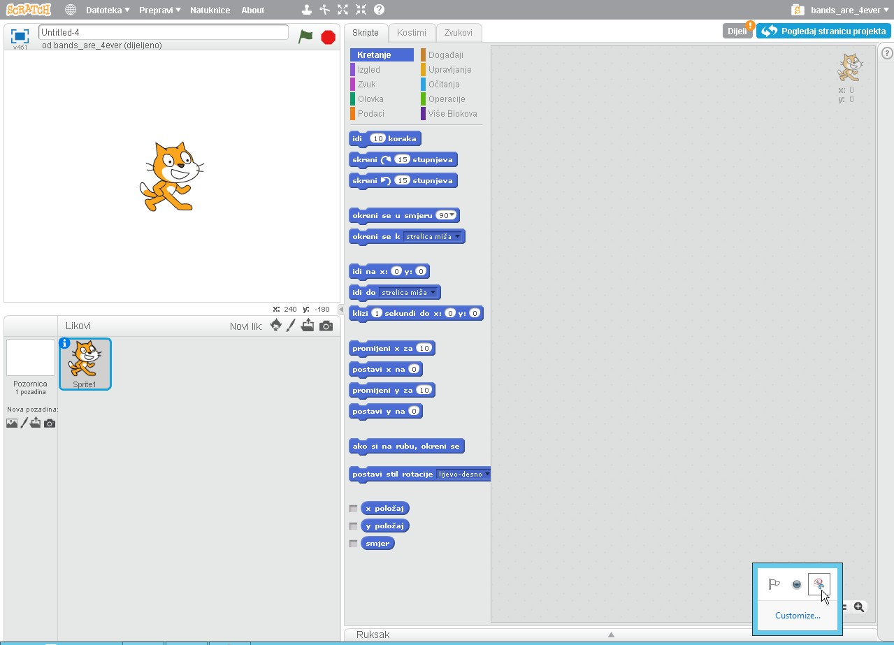

+ Mačka koju vidiš je maskota Scratcha. Ukloni ju tako da na nju klikneš desnom tipkom miša. Iz izbornika kojeg dobiješ odaberi naredbu 'obriši'.

	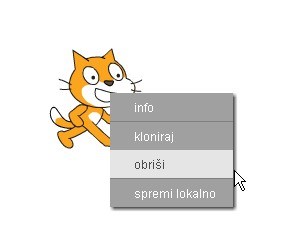

+ Za dodavanje novog lika potrebno je kliknuti na ikonu 'Odaberi lik iz knjižnice' kako bi se otvorio popis svih Scratch likova.

	

+ Listaj dolje dok ne pronađeš bubanj. Klikni na njega, a zatim na gumb 'OK' kako bi se bubanj dodao u projekt.

	

+ Klikni na ikonu 'umanji', zatim nekoliko puta na bubanj da se smanji.

	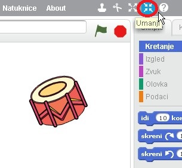


## Spremanje projekta. { .save }

Daj svom programu ime tako što ćeš ga upisati u okvir za tekst u gornjem lijevom kutu. Zatim iz izbornika 'Datoteka' odaberi naredbu 'Spremi'.

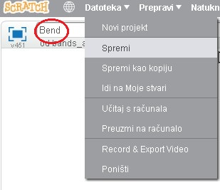


# Korak 2: Pozornica { .activity }

Pozornica je prostor na lijevoj strani i tamo će tvoj projekt oživjeti. Zamisli da je to prostor za izvedbu, kao prava pozornica!


## Zadatci { .check }

+ Trenutno je pozornica bijela i izgleda prilično dosadno! Dodajmo joj pozadinu klikom na 'Odaberi pozadinu iz knjižnice'	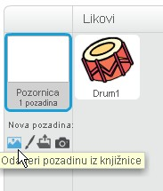

+ U izbornicima koji se nalaze na lijevoj strani odaberi 'Unutarnji prostor', pronađi i odaberi pozadinu pozornice i klikni na gumb 'OK'	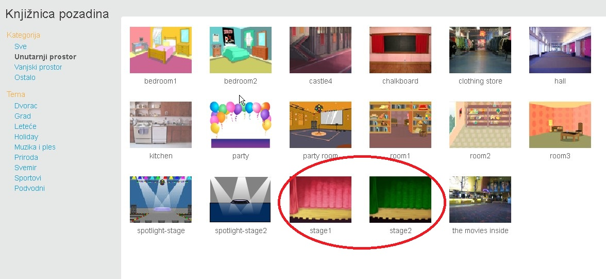

+ Tvoja pozornica bi sada trebala izgledati ovako:

	

# Korak 3: Stvaranje bubnja { .activity }

Sada ćemo programirati bubanj tako da proizvede zvuk svaki puta kada ga se udari.

## Zadatci { .check }

+ Blokove naredbi možeš pronaći na kartici 'Skripte'. Primjeti kako su razdvojeni u skupine koje su različito obojane! 
	
	Klikni na lik bubnja, zatim prenesi ova dva bloka s naredbama u prostor za unos naredbi koji se nalazi na desnoj strani prozora. Vodi računa o tome da su povezani (kao Lego kockice):

	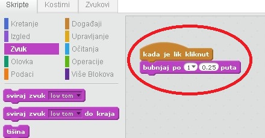

+ Klikni na bubanj i isprobaj svoj novi instrument! 
+ Stvarajući novi kostim možeš promijeniti izgled bubnja kada se na njega klikne. Odaberi karticu 'Kostimi' i vidjet ćeš sliku bubnja.

	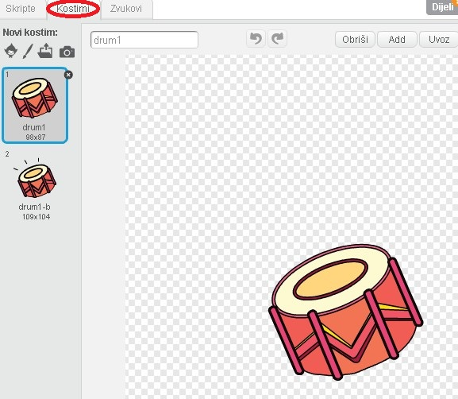

+ Klikni desnim klikom na kostim i klikni 'Kloniraj'. Napravit će se kopija kostima.

	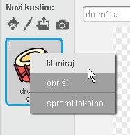

+ Klikni na novi kostim, odaberi alat za crtanje linija i nacrtaj linije tako da izgleda kao da bubanj proizvodi zvuk.

	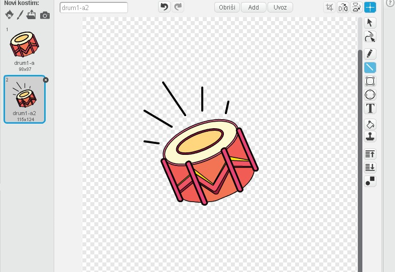

+ Imena kostima sada baš i nisu od velike pomoći. Preimenuj ih u 'nije udaren' i 'udaren' tako što ćeš upisati novo ime svakog kostima u okvir za tekst.

	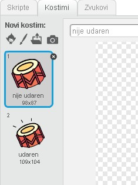

+ Sada kada imaš dva različita kostima za svoj bubanj, možeš odabrati koji kostim će se prikazati u kojem trenutku! Dodaj ove dvije naredbe svom bubnju:

	

	Naredba za promjenu kostima nalazi se u kartici 'Izgled' {.blocklooks}

+ Isprobaj svoj bubanj. Kada se na njega klikne, trebao bi izgledati kao da je udaren!


## Spremi promjene napravljene u projektu { .save }


##Izazov: Poboljšaj svoj bubanj. { .challenge }

+ Možeš li promijeniti zvuk kojeg proizvodi bubanj kada ga se klikne?

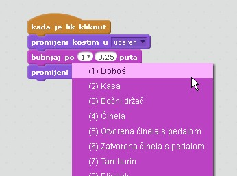

+ Možeš li postići da bubanj proizvede zvuk kada se pritisne razmaknica? Trebat će ti naredba {.blockevents}:

```blocks
	kada je tipka [razmaknica v] pritisnuta
```

Umjesto prenošenja možeš kopirati već postojeći kôd - klikni na njega desnom tipkom miša i odaberi naredbu 'kloniraj'.

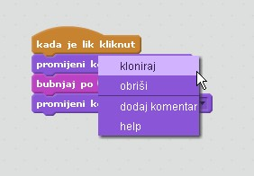


## Spremi promjene u projektu { .save }


# Korak 4: Stvaranje pjevačice { .activity .new-page }

Dodajmo bendu i pjevačicu!


## Zadatci { .check }

+ Na pozornicu dodaj još dva lika: pjevačicu i mikrofon.

	

+ Kako bi pjevačica zapjevala, liku treba dodati zvuk. Označi lik pjevačice, odaberi karticu 'Zvukovi' i ikonu 'Odaberi zvuk iz knjižnice':

	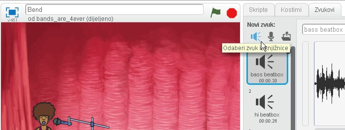

+ Prikladan zvuk nađi u izborniku 'Glasovi'.

	

+ Nakon dodavanja zvuka na kartici 'Skripte' dodaj sljedeći kôd:

	```blocks
		kada je lik kliknut
sviraj zvuk [singer1 v] do kraja

	```

+ Klikni na pjevačicu i provjeri pjeva li.


## Spremi promjene u projektu { .save }


##Izazov: Promjena kostima pjevačice { .challenge }

+ Možeš li napraviti da tvoja pjevačica izgleda kao da pjeva kada ju se klikne? Ako trebaš pomoć, možeš koristiti upute za stvaranje bubnja iznad.


Sjeti se testirati kako tvoj novi kod radi!


## Spremi svoj projekt { .save }


##Izazov: Napravi svoj vlastiti bend { .challenge }
Iskoristi sve prethodno naučeno za izradu svog vlastitog benda! Možeš stvoriti bilo koji instrument, a možeš i pregledati raspoložive zvukove i instrumente da dobiješ ideje.

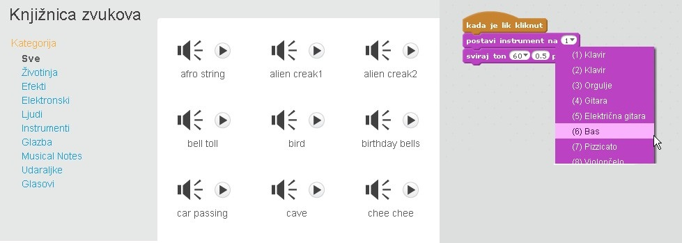

Tvoji instrumenti ne moraju predstavljati ono što jesu. Na primjer, možeš napraviti klavir od muffina!

 

Kao što koristiš već postojeće likove, možeš nacrtati i vlastite.

 

Imaš li mikrofon, možeš snimiti svoje vlastite zvukove. Također možeš koristiti i web kameru!


## Spremi svoj projekt { .save }
