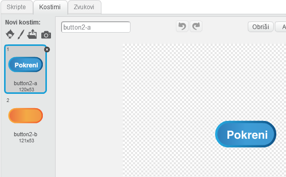
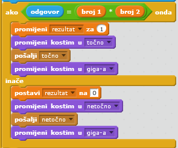
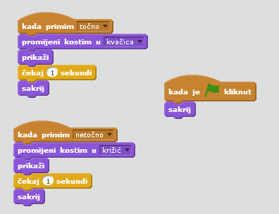

---
title: Mozgalica
level: Scratch 2
language: hr-HR
stylesheet: scratch
embeds: "*.png"
materials: ["Club Leader Resources/*"]
...

# Uvod { .intro }

U ovome projektu ćeš naučiti kako napraviti kviz u kojemu trebaš odgovoriti na koliko god pitanja možeš u 30 sekundi. 

<div class="scratch-preview">
  <iframe allowtransparency="true" width="485" height="402" src="http://scratch.mit.edu/projects/embed/42225768/?autostart=false" frameborder="0"></iframe>
  
</div>

# Korak 1: Izrada pitanja { .activity }

Krenimo sa izradom nasumičnih pitanja na koje će igrači odgovarati.

## Zadaci { .check }

+ Otvori novu Scratch projekt i obriši lik mačke da dobiješ prazan projekt. Možeš koristiti online Scratch editor koji se nalazi na adresi <a href="http://jumpto.cc/scratch-new">jumpto.cc/scratch-new</a>.

+ Odaberi lika i pozadinu za igru. Možeš odabrati bilo kojeg. Evo primjera:

		

+ Kreiraj dvije nove varijable koje se zovu 'broj 1' {.blockdata} i broj 2 {.blockdata}. Te varijable će spremiti 2 broja koja će se pomnožiti.
	

+ Dodaj kod odabranom liku kako bi postavio obje varijable na 'random'{.blockoperators} broj između 2 i 12.

	```blocks
		when flag clicked
		set [number 1 v] to (pick random (2) to (12))
		set [number 2 v] to (pick random (2) to (12))
	```

+ Tada možeš pitati igrača za odgovor i pustiti ga da vidi je li odgovorio točno ili ne.

	```blocks
		when flag clicked
		set [number 1 v] to (pick random (2) to (12))
		set [number 2 v] to (pick random (2) to (12))
		ask (join (number 1)(join [ x ] (number 2))) and wait
		if <(answer) = ((number 1)*(number 2))> then
			say [yes! :)] for (2) secs
		else
			say [nope :(] for (2) secs
		end
	```

+ Testiraj projekt odgovarajući na jedno pitanje točno, a na jedno pogrešno.

+ Dodaj `forever` {.blockcontrol} petlju oko svog koda, tako da će igraču biti postavljeno puno pitanja.

+ Napravi odbrojavanje na pozornici koristeći varijablu koja se zove 'time' {.blockdata}. Projekt 'Balloons' sadrži instrukcije koje će napraviti odbrojavanje (u koraku 6) ako trebaš pomoć.

+ Ponovo testiraj projekt - pitanja bi se trebala pojavljivati dok vrijeme ne istekne.

## Spremi projekt. { .save }

## Izazov: Promijena kostima {.challenge}
Možeš li promijeniti kostim lika tako da odgovara igračevu odgovoru?


## Izazov: Dodavanje rezultata {.challenge}
Možeš li dodati rezultat svojoj igri? Možeš dodati bod za svaki točan odgovor. Želiš li otežati igru, možeš resetirati igračev rezultat na nulu čim odgovore pogrešno.

## Spremi promjene u projektu. { .save }

# Korak 2: Više igara { .activity .new-page}

Želiš li igrati igru više puta, možeš dodati gumb 'play'.

## Zadaci { .check }

+ Dodaj gumb 'play' iz biblioteke likova (možeš ga i nacrtati) na kojeg će igrač kliknuti kako bi pokrenuo novu igru.

	

+ Dodaj ovaj kod tvome gumbu.

	```blocks
		when flag clicked
		show

		when this sprite clicked
		hide
		broadcast [start v]
	```

	Ovaj kod će pokazati gumb play kada se projekt upali. Kada igrač klikne gumb, on nesgtaje i prikazuje poruku koja će pokrenuti igru.

+ Trebat ćeš urediti kod tvoga lika tako da igra počne kada dobiju 'start' poruuku {.blockevents}, a ne kada je kliknuta zastava.

	Zamijeni `when flag clicked` {.blockevents} kod sa `when I receive start` {.blockevents}.

	

+ Klikni na zelenu zastavu i tada klikni novi play gumb i testiraj program. Možeš vidjeti da igra ne počinnje dok igrač ne stisne start gumb.

+ Jesi li primjetio da odbrojavanje počinje kada se klikne zelena zastava, a ne kada počne igra?

	

	Možeš li popraviti problem?

+ Klikni na pozornicu i zamijeni `stop all` {.blockcontrol} naredbu sa `end` {.blockevents} porukom.

	

+ Sada možeš dodati kod svome gumbu kako bi se ponovo pokazao na kraju svake igre.

	```blocks
		when I receive [end v]
		show
	```

+ Također trebaš napraviti da lik prestane ispitivati pitanja na kraju svake igre:

	```blocks
		when I receive [end v]
		stop [other scripts in sprite v]
	```

+ Testiraj gumb play tako što ćeš igrati nekoliko puta. Trebaš primjetiti da se nakon svake igre pojavi gumb play. Kako bi ti testiranje bile lakše, možeš skratiti svaku igru tako da traje samo nekoliko sekundi.

	```blocks
		set [time v] to [10]
	```

+ Možeš čak i promijeniti izgled gumba kada miš prijeđe preko njega. 

	```blocks
		when flag clicked
		show
		forever
		if <touching [mouse-pointer v]?> then
			set [fisheye v] effect to (30)
		else
			set [fisheye v] effect to (0)
		end
		end
	```

	

## Spremi promjene u projektu. { .save }

## Izazov: Početni zaslon {.challenge}
Možeš li dodati još jednu pozadinu na pozornicu? Ona bi trebala biti početni zaslon tvoje igre. Možeš koristiti `when I receive start` {.blockevents} i `when I receive end` {.blockevents} naredbe kako bi mjenjao pozadine.

Također možeš prikazati i sakriti svoga lika i odbrojavanje koristeći ove naredbe:

```blocks
show variable [time v]
```
```blocks
hide variable [time v]
```


## Spremi promjene u projektu. { .save }

# Korak 3: Dodavanje grafike { .activity .new-page}

Umjesto da tvoj lik samo govori 'yes! :)' ili 'nope :(' igraču, možeš dodati neku grafiku koja će pokazati igraču kako mu ide.

+ Dodaj novog lika koji se zove 'Result' i koji sadrži i 'tick' i 'cross' kostim.

	

+ Promijeni kod svoga lika tako da umijesto da samo govori igraču kako mu ide, pokazuje 'correct' `correct` {.blockevents} i `wrong` {.blockevents} poruke. 

	

+ Sada možeš upotrijebiti ove poruke kako bi prikazao 'tick' ili 'cross' kostime. Dodaj taj kod tvom novom 'Result' liku:

		

+ Ponovo testiraj igru. Trebaš vidjeti kvačicu svaki put kada je odgovor točan, a križić svaki put kada je pogrešan.

	

+ Primječuješ li da su kodovi za `when I receive correct` {.blockevents} i `when I receive wrong` {.blockevents} gotovo identični? Napravimo funkciju koja će olakšati promjene u kodu.

	Na 'Result' liku, klikni `More Blocks` {.blockmoreblocks}, pa onda 'Make a Block'. Napravi novu funkciju koja se zove `animate` {.blockmoreblocks}.

	

+ Tada možeš dodati kod animacije u svoju novu funkciju nanimacije, i onda samo dva puta iskoristi funkciju:

	

+ Sada, ako želiš da se kvačica i križić prikazuju na dulje ili kraće vrijeme, trebaš napraviti samo jednu promijenu. Pokušaj!

+ Umijesto da se križić i kvaćica samo prokazuju, trebaš promijeniti funkciju animacije tako da se grafika polako pojavljuje i nestaje.

	```blocks
		define [animate]
		set [ghost v] effect to (100)		
		show
		repeat (25)
			change [ghost v] effect by (-4)
		end
		hide
	```

## Spremi promijene u projektu. { .save }

## Izazov: Poboljšavanje animacije {.challenge}
Možeš li poboljšati animaciju svoje grafike? Možeš staviti kod na kvaćicu i križić tako da oni polako nestaju i pojavljuju se. A možeš i koristiti druge super efekte:


## Spremi promjene u projektu. { .save }

## Izazov: Zvuk i glazba {.challenge}
Možeš li dodati zvučne efekte i glazbu svojoj igrici? Na primjer:

+ Pojavljivanje zvuka kada igrač odgovori točno ili pogrešno;
+ Dodavanje ticking sound to your countdown timer;
+ Puštanje zvuka kada vrijeme istekne;

	```blocks
		play drum (10 v) for (0.1) beats
	```

+ Također možeš konstantno ponavljati glazbu (ako ne znaš kako to napraviti, korak 4 projekta 'Rock Band' će ti pomoći).

## Spremi promjene u projektu. { .save }

## Izazov: Utrka do 10 bodova {.challenge}
Možeš li promijeniti igru tako da umijesto odgovaranja na koliko god pitanja se stigne u 30 sekundi, igrač će vidjeti koliko brzo može odgovoriti točno na 10 pitanja?

To možeš napraviti mjenjanjem koda odbrojavanja. Možeš li vidjeti što se treba promijeniti?

```blocks
	when I receive [start v]
	set [time v] to (30)
	repeat until <(time) = [0]>
		wait (1) secs
		change [time v] by (-1)
	end
	broadcast [end v]
```

## Spremi promjene u projektu. { .save }

## Izazov: Ekran s instrukcijama {.challenge}
Možeš li dodati ekran s instrukcijama tvojoj igrici? On će reći tvom igraču kako da se igra igrica. Trebat će ti gumb 'Instructions' i još jedna pozadina za pozornicu.


Također će ti trebati gumb 'Back' kako bi odveo igrača na glavni izbornik.

```blocks
	broadcast [main menu v]
```

## Spremi projekt. { .save }
