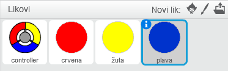

---
title: Hvatanje točki
level: Scratch 2
language: hr-HR
stylesheet: scratch
embeds: "*.png"
materials: ["Club Leader Resources/*", "Project Resources/*"]
beta: true
...

# Uvod { .intro }

U ovom projektu naučit ćeš kako kreirati igru u kojoj moraš uskladiti obojane točkice sa točnim dijelovima kontrolera.

<div class="scratch-preview">
  <iframe allowtransparency="true" width="485" height="402" src="http://scratch.mit.edu/projects/embed/44942820/?autostart=false" frameborder="0"></iframe>
  
</div>

# Korak 1: Izrada kontrolera { .activity }

Počnimo sa izradom kontrolera koji će se koristiti kako bi se prikupile točke. 

## Zadaci { .check }

+ Otvori novu Scratch projekt i obriši lik mačke da dobiješ prazan projekt. Možeš koristiti online Scratch editor koji se nalazi na adresi <a href="http://jumpto.cc/scratch-new">jumpto.cc/scratch-new</a>.

+ Ako ti je volonter pokazao mapu 'Resources', klikni 'Upload sprite from file' i dodaj sliku 'controller.svg'. Trebaš premijestiti lika u centar pozornice.

	
	
	Ako nemaš tu sliku, možeš sam nacrtati lika!
	
+ Okreni kontroler desno kada se pritisne desna strelica na tipkovnici:

	```blocks
		when flag clicked
		forever
			if <key [right arrow v] pressed?> then
				turn right (3) degrees
			end
		end
	```
+ Testiraj svoj kontroler -- trebao bi se vrtiti na desno.

## Spremi svoj projekt. { .save }

## Izazov: Okretanje na lijevo {.challenge}
Možeš li napraviti da se kontroler okreće lijevo kada se pritisne lijeva strelica na tipkovnici?

## Spremi promijene u projektu. { .save }

# Korak 2: Skupljanje točaka { .activity }

Dodajmo nekoliko točaka kako bi ih igrač pokupio sa kontolerom.

## Zadaci { .check }

+ Kreiraj novog lika koji se zove 'red'. Taj lik bi trebao biti mala crvena točka.

	

+ Dodaj ovo svome liku 'red' točka, kako bi se svakih nekoliko sekundi kreirao duplikat točke:

	```blocks
		when flag clicked
		wait (2) secs
		forever
			create clone of [myself v]
			wait (pick random (5) to (10)) secs
		end
	```

+ Kada god se pojavi duplikat, želiš da se pojavi u jednome od 4 kuta pozornice.

	

	Kako bi napravio to, prvo kreiraj novu varijablu koja se zove `start positions` {.blockdata} i klikni `(+)` kako bi dodao vrijednosti `-180` i `180`.

	

+ Možeš koristiti ova 2 (list items) da odabereš nasumičak kut pozornice. Dodaj ovaj kod 'dot' liku, tao da se svaki novi duplikat kreće u nasumičan kut, a onda se polako kreće prema kontroleru.
	```blocks
		when I start as a clone
		go to x: (item (random v) of [start positions v]) y: (item (random v) of [start positions v])
		point towards [controller v]
		show
		repeat until <touching [controller v]?>
			move (1) steps
		end
	```

	Kod iznad bira ili `-180` ili `180` za x _i_ y pozicije, što znači da svaki put duplikat počinje u jednome kutu pozornice.

+ Testiraj projekt. Trebaš vidjeti puno crvenih točaka koje se pojavljuju u svakome uglu ekrana i polako se pokreću prema kontroleru.

	

+ Napravi dvije nove varijable koje se zovu`lives` {.blockdata} i `score` {.blockdata}.

+ Dodaj kod na pozornici kako bi postavio `lives` {.blockdata} ma 3 i `score` {.blockdata} na 0 na početku igrice.

+ Trebaš dodati ovaj kod na kraj koda `when I start as a clone` {.blockcontrol} crvene točke, tako da se 1 bod dodaje igračevu `score` {.blockdata} ako se boje poklapaju, ili se 1 oduzima iz igračevih `lives` {.blockdata} ako se boje ne poklapaju.

	```blocks
		move (5) steps
		if <touching color [#FF0000]?> then
			change [score v] by (1)
			play sound [pop v]
		else
			change [lives v] by (-1)
			play sound [laser1 v]
		end
		delete this clone
	```

+ Dodaj ovaj kod na kraj pozornicine (script) tako da igra završi kada igrač izgubi sva 3 života:

	```blocks
		wait until <(lives) < [1]>
		stop [all v]
	```

+ Testiraj igricu da vidiš radi li kod kako treba.

## Spremi promjene u projektu { .save }

## Izazov: Više točaka {.challenge}
Dupliciraj svoga lika 'red' točku dva puta i imenuj dva nova lika 'yellow' i 'blue'.



Uredi te likov (uključujući i njihov kod), tako da svaka točka odgovara boji kontrolera. Nemoj zaboraviti testirati svoj projekt i uvjeriti se da igrač dobije bodove i gubi živote kako bi i trebao, i da igra nije previše lagana ili previše teška.


## Spremi promjene u projektu { .save }

# Korak 3: Povećavanje težine { .activity .new-page}

Napravimo da igrica postaje sve teža što dulje ju igrač igra, polako smanjujući razmak između točaka koje se pojavljuju.

## Zadaci { .check }

+ Napravi novu varijablu koja se zove `delay` {.blockdata}.

+ Na pozornici, napravi novi (script) koji postavlja delay na visoki broj, a onda polako reducira vrijeme odgode (delaya).

	```blocks
		when flag clicked
		set [delay v] to (8)
		repeat until < (delay) = (2)>
			wait (10) secs
			change [delay v] by (-0.5)
		end
	```

	Primijeti da je ovo vrlo slično načinu na koji radi odbrojavanje igre!

+ Možeš korisiti `delay` {.blockdata} varijablu u svojim crvenim, plavim i žutim (scripts). Ukloni kod koji čeka nasumičan broj sekundi prije izrade duplikata i zamijeni ga s novom `delay` {.blockdata} varijablom: 

	```blocks
		wait (delay) secs
	```

+ Testiraj svoju novu `delay` {.blockdata} varijablu i vidi reducira li se razmak između točaka. Radi li to za sve 3 boje točaka? Možeš li vidjeti da se vrijednost `delay` {.blockdata} varijable reducira?

## Spremi promjene u projektu { .save }

## Izazov: Brže kretanje točaka {.challenge}
Možeš li poboljšati igru dodajući varijablu `speed` {.blockdata}, tako da se točke počnu kretati korak po korak, i polako postaju sve brže? To će raditi na vrlo sličan način kao `delay` {.blockdata} varijabla koju smo koristili gore. Taj kod ti može pomoći.

## Spremi promjene u projektu { .save }

# Korak 4: Najbolji rezultat { .activity }

Spremimo najbolji rezltat kako bi igrači vidjeli kako im ide.

## Zadaci { .check }

+ Napravi novu varijablu koja se zove `high score` {.blockdata}.

+ Klikni na pozornicu i napravi novi blok naredbi `check high score` {.blockmoreblocks}.

	

+ Dodaj novi blok naredbi taman prije završetka igre.

	

+ Dodaj ovaj kod svom bloku naredbi kako bi spremio trenutni `score` {.blockdata} kao `high score` {.blockdata} `if` {.blockcontrol} je to najbolji rezultat do sada:

	```blocks
		define [check high score]
		if <(score) > (high score)> then
			set [high score v] to (score)
		end
	```

+ Testiraj kod. Igraj igricu kako bi provjerio mijenja li se`high score` {.blockdata} kako bi trebao.

## Spremi promjene u projektu { .save }

## Izazov: Poboljšaj svoju igru! {.challenge}
Možeš li smisliti načine na koje ćeš poboljšati svoju igru? Na primjer, možeš napraviti posebne točke koje:

+ poduplaju tvoj rezultat;
+ usporavaju točke;
+ skrivaju sve druge točke na ekranu!

## Spremi promjene u projektu { .save }

## Izazov: Izbornik {.challenge}
Možeš li dodati izbornik (sa gumbima) u igricu? Trebaš dodati ekran sa instrukcijama, ili odvojeni ekran koji će pokazivati najbolji rezultat. Ako trebaš pomoć s time, projekt 'Mozgalica' će ti pomoći.
