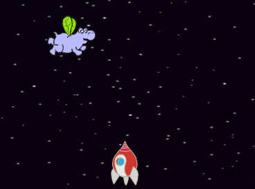
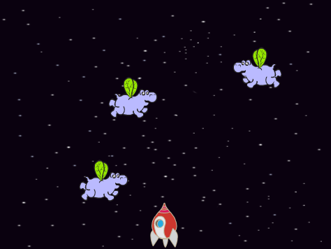
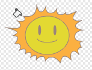
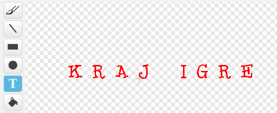
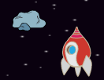

---
title: Ratovi klonova
level: Scratch 2
language: hr-HR
stylesheet: scratch
embeds: "*.png"
materials: ["Club Leader Resources/*"]
beta: true
...

## Community Contributed Project { .challenge .pdf-hidden }
This project was created with Erik. If you'd like to contribute a project of your own, then [get in touch with us on Github](https://github.com/CodeClub).

# Uvod { .intro }

U ovome projektu naučit ćeš kako napraviti igricu u kojoj moraš spasiti Zemlju od čudovišta iz svemira.

<div class="scratch-preview">
  <iframe allowtransparency="true" width="485" height="402" src="http://scratch.mit.edu/projects/embed/46018140/?autostart=false" frameborder="0"></iframe>
  
</div>

# Korak 1: Izrada svemirskog broda { .activity }

Napravimo svemirski brod koji će braniti Zemlju!

## Zadaci { .check }

+ Otvori novu Scratch projekt i obriši lik mačke da dobiješ prazan projekt. Možeš koristiti online Scratch editor koji se nalazi na adresi <a href="http://jumpto.cc/scratch-new">jumpto.cc/scratch-new</a>.

+ Dodaj 'stars' pozadinu i 'Spaceship' lika svome projektu. Smanji svemirski brod i pomakni ga na dno ekrana.

	

+ Dodaj kod kako bi pomaknuo svemirski brod na lijevo kada se pritisne lijeva strelica na tipkovnici. Trebat ćeš koristiti ovaj blok naredbi:

	```blocks
		when flag clicked
		forever
			if <key [left arrow v] pressed?> then
				change x by (-4)
			end
		end
	```

+ Dodaj kod koji će pokretati tvoj svemirski brod na desno kada se pritisne desna strelica na tipkovnici.

+ Testiraj svoj projekt kako bi vidio možeš li kontrolirati svoj svemirski brod sa strelicama na tipkovnici.

## Spremi svoj projekt. { .save }

# Korak 2: Munje { .activity }

Dajmo svemirskome brodu mogućnost da ispaljuje munje.

## Zadaci{ .check }

+ Dodaj lika 'Lightning' iz biblioteke likova. Klikni na kostim lika i okreni munju prema dolje.

	

+ Kada se igra pokrene, munja bi trebala biti skrivena sve dok svemirski brod ne ispali laserske topove.

	```blocks
		when flag clicked
		hide
	```

+ Dodaj slijedeći kod **to the Spaceship** kako bi se nova munja stvorila svaki put kada se stisne tipka Space.


	```blocks
		when flag clicked
		forever
			if <key [space v] pressed?> then
				create clone of [Lightning v]
			end
		end
	```

+ Kada god se kreira novi klon, trebao bi se pojaviti na istome mjestu kao i svemirski brod, a tada se pomicati do pozornice dok ne dođe do ruba. Dodaj ovaj kod **to the Lightning sprite**:

	```blocks
		when I start as a clone
		go to [Spaceship v]
		show
		repeat until <touching [edge v] ?>
			change y by (10)
		end
		delete this clone
	```

Bilješka: Pokrećemo novog klona prema svemirskome brodu dok je on još uvijek skriven.

+ Testiraj munje tako što ćeš stisnuti tipku Space.

## Spremi promjene u projektu { .save }

## Izazov: Popravljanje munje {.challenge}
Što se događa ako cijelo vrijeme drži  tipku space? Možeš li iskoristiti `wait` {.blockcontrol} naredbu da popraviš to?

## Spremi promjene u projektu { .save }

# Korak 3: Leteći svemirski nilski konji { .activity }

Dodajmo leteće nilske konje koji pokušavaju uništiti svemirski brod. 

## Zadaci { .check }

+ Napravi novog lika sa slike 'Hippo1' iz biblioteke likova.

	

+ Napravi da se može kretati samo lijevo i desno i dodaj ovaj kod kako bi sakrio lika kada počne igrica:

	```blocks
		when flag clicked
		hide
	```

+ Kreiraj novu varijablu koja se zove `speed` {.blockdata}, i koja je samo za lika nilskog konja.

	

	Znati ćeš je li dobro napravljeno zato što će varijabla imati ime lika kraj nje, ovako:

	

+ Idući kod će kreirati novog nilskog konja svakih nekoliko sekundi. **The Stage** je dobro mjesto za staviti ovaj kod:

	```blocks
		when flag clicked
		forever
			wait (pick random (2) to (4)) secs
			create clone of [Hippo1 v]
		end
	```

+ Kada svaki duplikat nilskog konja krene, napravi da se kreće oko pozornice (nasumičnom brzinom) dok ga ne udari munja. Dodaj ovaj kod **to the hippo** sprite

	```blocks
		when I start as a clone
		set [speed v] to (pick random (2) to (4))
		go to x: (pick random (-220) to (220)) y: (150)
		show
		repeat until <touching [lightning v] ?>
			move (speed) steps
			turn right (pick random (-10) to (10)) degrees
			if on edge, bounce
		end
		delete this clone
	```

+ Testiraj svoj kod za nilske konje. Novi nilski konj trebao bi se pojavljivati svakih nekoliko sekundi, i svaki od njih bi se trebao kretati vlastitom brzinom.

	

+ Testiraj svoj laserski top. Ako udariš nilskog konja, nestane li?

+ Kada nilski konj dodirne tvoj svemirski brod, on bi trebao eksplodirati. Da napraviš to, prvo provjeri ima li tvoj svemirski broj 2 kostima koji se zovu 'normal' i 'hit'.

	

	The spaceship's 'hit' costume can be made by importing the 'Sun' image from the Scratch library, and using the 'Color a shape' tool to change its colour.

	

+ Dodaj ovaj kod svome svemirskome brodu tako da zamijeni kostime kada god se sudari sa letećim nilskim konjem:

	```blocks
		when flag clicked
		forever
			switch costume to [normal v]
			wait until <touching [Hippo1 v]>?
			switch costume to [hit v]
			broadcast [hit v]
			wait (1) secs
		end
	```

+ Primječuješ li da imaš prikazanu poruku 'hit' u kodu ispod? Možeš koristiti tu poruku da napraviš da svi nilski konji nestanu kada je svemirski brod udaren.

	Dodaj ovaj kod nilskome konju:

	```blocks
		when I receive [hit v]
		delete this clone
	```

+ Testiraj kod tako što ćeš pokrenuti novu igru i sudariti se sa nilskim konjem.

	

## Spremi promjene u projektu. { .save }

## Izazov: Životi i bodovi {.challenge}
Možeš li dodati `lives` {.blockdata}, `score` {.blockdata} ili čak `highscore` {.blockdata} svojoj igrici? Projekt "Uhvati točke" će ti pomoći.

## Spremi promjene u projektu.{ .save }

# Korak 4: Šišmiši s voćem { .activity }

Napravimo šišmiša koji baca naranče na svemirski brod.

## Zadaci { .check }

+ Prvo napravi lika šišmiša koji će se `move` {.blockmotion} kroz vrh pozornice `forever` {.blockcontrol}. Nemoj zaboraviti testirati kod.

	

+ Ako pogledaš šišmiševe kostime, vidjet ćeš da već ima dva:

	

	Iskoristi naredbu `next costume` {.blocklooks} kako bi napravio da šišmiš maše krilima dok se pomiće.

+ Učitaj novog 'Orange' lika iz biblioteke s likovima.

	


+ Dodaj kod svome šišmišu tako da može napraviti novu dupliciranu naranču svakih nekoliko sekundi.

	```blocks
		when flag clicked
		forever
			wait (pick random (5) to (10)) secs
			create clone of [Orange v]
		end
	```

+ Klikni na lik naranče kako bi dodao ovaj kod. Tako će šišmiš ispustiti duplikat naranče prema svemirskome brodu.

	```blocks
		when flag clicked
		hide

		when I start as a clone
		go to [Bat1 v]
		show
		repeat until <touching [edge v]?
			change y by (-4)
		end
		delete this clone

		when I receive [hit v]
		delete this clone
	```

+ Trebaš promijeniti svoga lika svemirskog broda tako da kada dodirne naranču ili nilskog konja bude udaren:

	```blocks
		wait until < <touching [Hippo1 v]?> or <touching [Orange v]?>>
	``` 

+ Testiraj svoju igricu. Što se dogodi ako te udari padajuća naranča?

## Spremi promjene u projektu. { .save }

# Korak 5: Kraj igre { .activity }

Dodajmo 'game over' poruku na kraj ove igre.

## Zadaci { .check }

+ Ako već nisi, napravi novu varijablu koja se zove `lives` {.blockdata}. Tvoj svemirski brod treba početi sa 3 života i izgubiti život kada god se sudari sa neprijateljem. Tvoja igra također treba završiti kada igraču ponestane života. Ako trebaš pomoć, možeš koristiti projekt 'Uhvati točke' kako bi si pomogao. 

+ Nacrtaj novog lika koji se zove 'Game Over', koristeći alat za tekst.

	

+ Na svojoj pozornici, prenesi `game over` {.blockevents} poruku taman kada igra treba završiti.

	```blocks
		broadcast [game over v] and wait
	```

+ Dodaj ovaj kod svome 'Game Over' liku, tako da se porukaa pokaže na kraju igre:

	```blocks
		when flag clicked
		hide

		when I receive [game over v]
		show
	```

	Zato što si koristio naredbu `broadcast [game over] and wait` {.blockevents} na pozornici, čekati će 'Game Over' lika da se pojavi prije kraja igre.

+ Testiraj igru. Koliko bodova možeš skupiti? Možeš li smisliti načine kako bi poboljšao igru ako je ovo previše lagano ili previše teško?

## Spremi promjene u projektu. { .save }

## Izazov: Poboljšaj igricu{.challenge}
Koja poboljšanja možeš napraviti u igrici? Evo nekih ideja:
+ Dodaj (health packs) koji se mogu skupiti kako bi igrač dobio dodatan život;


+ Dodaj stijene koje svemirski brod mora izbijeći;
	


+ Kada rezultat dođe do 100, napravi da se pojavi još neprijatelja.

```blocks
	wait until <(score) = [100]>
```

## Spremi projekt. { .save }