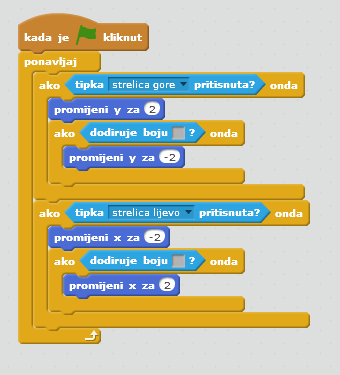
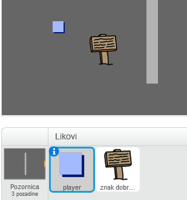
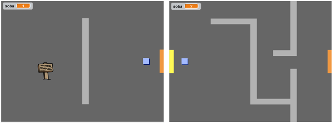
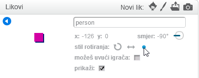
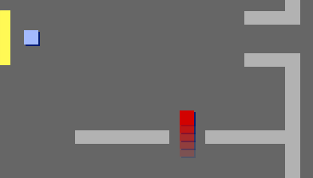
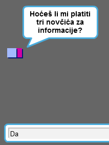
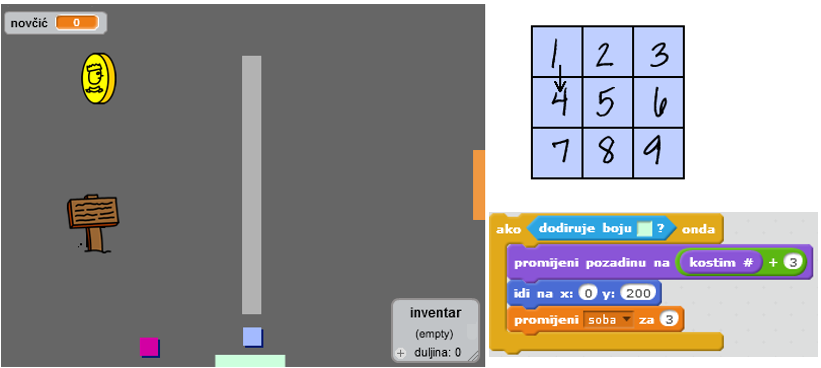

---
title: Kreiraj vlastiti svijet
level: Scratch 2
language: hr-HR
stylesheet: scratch
embeds: "*.png"
materials: ["Club Leader Resources/*","Project Resources/*"]
...

# Uvod{ .intro }

U ovom projektu naučit ćeš napraviti vlastitu igricu avanture. 

<div class="scratch-preview">
  <iframe allowtransparency="true" width="485" height="402" src="http://scratch.mit.edu/projects/embed/34248822/?autostart=false" frameborder="0"></iframe>
  
</div>

# Step 1: Izrada igrača { .activity }

Krenimo kreirajući igrača koji se može kretati po tvom svijetu. 

## Zadatci { .check }

+ Otvori novi Scratch projekt i obriši lik mačke tako da dobiješ prazan projekt. Online Scratch nalazi se na adresi <a href="http://jumpto.cc/scratch-new">jumpto.cc/scratch-new</a>.

+ Za ovaj projekt trebat će ti mapa 'Project Resources' koja sadrži sve slike koje će ti trebati. Pristup mapi omogućit će ti voditelj radionice. 

	

+ Dodaj sliku 'room1.png' za novu pozadinu pozornice i sliku 'player.png' za novog lika. Ukoliko nemaš pristup slikama, slobodno nacrtaj svoje! Ovako bi projekt trebao izgledati:  

	

+ Za kretanje igrača koristit će se strelice. Kada igrač pritisne strelicu gore, lik se treba kretati prema gore. To ćeš postići mijenjanjem koordinate y. Liku igrača dodaj sljedeće naredbe: 

	```blocks
		kada je ⚑ kliknut
		ponavljaj
   			ako <tipka [strelica gore v] pritisnuta?> onda
      				promijeni y za (2)
   			end
		end
	```

+ Provjeri naredbe tako što ćeš kliknuti na zastavicu, a zatim drži pritisnutu strelicu gore. Pomiče li se igrač prema gore? 

	

+ Za pomicanje igrača u lijevo trebaš dodati još jednu `ako je` {.blockcontrol} naredbu koja će mijenjati x koordinatu. 

	```blocks
		kada je ⚑ kliknut
		ponavljaj
   		ako <tipka [strelica gore v] pritisnuta?> onda
      			promijeni y za (2)
   		end
   		ako <tipka [strelica lijevo v] pritisnuta?> onda
      			promijeni x za (-2)
   		end
		end

	```

## Izazov: pomicanje u sva četiri smjera {.challenge}
Možeš li dodati naredbe kojima ćeš svog igrača pomicati u sva četiri smjera: gore, dolje, lijevo i desno? Iskoristi prethodne naredbe! 

## Spremi projekt { .save }

+ Pokreni projekt. Uočit ćeš da se igrač može kretati i kroz svijetlosive zidove. 

	

+ Da to popraviš, morati ćeš igrača vratiti natrag kada dotakne zid. Ovdje su naredbe koje ti trebaju za to: 

	```blocks
		kada je ⚑ kliknut
		ponavljaj
   		ako <tipka [strelica gore v] pritisnuta?> onda
      			promijeni y za (2)
      			ako <dodiruje boju [#BABABA]?> onda
         			promijeni y za (-2)
      			end
   		end
		end
	```

	Primijeti da se nova `ako je`{.blockcontrol} `dodiruje boju`{.blocksensing} naredba nalazi _unutar_ naredbe  `ako je`{.blockcontrol} `tipka [strelica gore] pritisnuta`{.blocksensing}.

+ Testiraj nove naredbe pomičući se kroz zid - sada to ne bi trebalo biti moguće.
	

+ Napravi to i za lijevu strelicu - vrati natrag igrača ako dotakne zid. Kôd za lik igrača sada bi trebao izgledati ovako: 

	

## Izazov: Popravljanje pokreta igrača {.challenge}
Dodaj naredbe kojima ćeš onemogućiti igrača da prolazi kroz zid u bilo kojem smjeru. Prethodni kôd ti može pomoći. 

## Spremi promjene u projektu { .save }

# Korak 2: Programiraj svoj svijet { .activity }

Dopustimo igraču da prođe kroz vrata u drugu sobu. 

## Zadatci { .check }

+ Dodaj još dvije pozadine na pozornicu ('room2.png' i 'room3.png'), tako da ukupno imaš tri pozadine. Provjeri jesu li u ispravnom redoslijedu - to će ti koristiti kasnije.  

	

+ Trebat će ti nova varijabla `soba` {.blockdata} koja će pratiti u kojoj sobi se igrač nalazi.  

	

+ Kada igrač dotakne narančasta vrata u prvoj sobi, treba se prikazati sljedeća pozadina i igrač bi se trebao vratiti na lijevu stranu pozornice. Ovdje su naredbe koje će ti trebati. Postavi ih unutar petlje `ponavljaj` {.blockcontrol}:

	```blocks
		ako <dodiruje boju [#F2A24A]?> onda
   			promijeni pozadinu na [sljedeća pozadina v]
   			idi na x:(-200) y:(0)
   			promijeni [room v] za (1)
		end
	```

+ Sljedeće naredbe dodaj na  _početak_ bloka naredbi lika igrača (prije petlje `ponavljaj` {.blockcontrol} loop) da se osiguraš da će se sve vratiti na početnu poziciju kada se klikne zastavica. 

	```blocks
		postavi [room v] na (1)
		idi na x:(-200) y:(0)
		promijeni pozadinu na [room1 v]
	```

+ Klikni na zastavicu i pomiči igrača kroz narančasta vrata. Prelazi li igrač na novi ekran? Mijenja li se vrijednost varijable `soba` {.blockdata} na 2?

	

## Izazov: Vraćanje u prethodnu sobu {.challenge}
Možeš li napraviti da se igrač vrati u prethodnu sobu kada prođe kroz žuta vrata? Upamti da će taj kôd biti _vrlo_ sličan kôdu kojim igrač prelazi u sljedeću sobu. 

## Spremi promjene u projektu { .save }

# Korak 3: Znakovi { .activity }

Dodajmo znakove koji će voditi igrača.

## Zadatci { .check }

+ Dodaj novi lik iz datoteke - 'sign.svg'. Preimenuj lika u 'znak dobrodošlice'.

	

+ Taj znak treba biti vidljiv jedino u prvoj sobi. Da to osiguraš, dodaj mu sljedeće naredbe:

	```blocks
		kada je ⚑ kliknut
		ponavljaj
   		ako <(room) = [1]> onda
      			prikaži
   		inače
      			sakrij
   		end
		end
	```

+ Provjeri kôd pomicanjem između soba. Znak bi trebao biti vidljiv samo u prvoj sobi. 

	

+ Znak nije dobar ako ništa ne kaže! Dodajmo naredbe (u novom, odvojenom bloku) koje će prikazati poruku ako igrač dodirne znak: 

	```blocks
		kada je ⚑ kliknut
		ponavljaj
   		ako <dodiruje [player v]?> onda
      			reci [Pozdrav! Možeš li doći do blaga?]
   		inače
      			reci []
   		end
		end

	```
+ Test out your sign, and you should see a message when the player touches it.

	

## Save your project { .save }

## Challenge: Treasure! {.challenge}
Can you add a new treasure chest sprite, using the image 'chest.svg'. This treasure chest should be placed in room 3, and should say 'Well done!' when the player touches it.


## Save your project { .save }

# Step 4: People { .activity }

Let's add other people to your world that your player can interact with.

## Activity Checklist { .check }

+ Add in a new person sprite, using the image 'person.png'.

	

+ Add in this code, so that the person talks to your player. This code is very similar to the code you added to your sign:

	```blocks
		when flag clicked
		go to x: (-200) y: (0)
		forever
			if < touching [player v]? > then
				say [Did you know that you can go through orange and yellow doors?]
			else
				say []
			end
		end
	```

+ You could also allow your person to move, by using these two blocks:

	```blocks
		move (1) steps
		if on edge, bounce
	```

	Your person will act differently, depending on whether you place this code inside the `forever` {.blockcontrol} loop or the `if` {.blockcontrol} block. Try both and see which you prefer.

	

+ Have you noticed that your person flips upside-down. To stop this, click the sprite's information icon (`i`{.blockmotion}), and click the dot to fix to rotation style.

	

## Challenge: Improving your person {.challenge}
Can you add code to your new person, so that they only appear in room 1? Make sure you test out your new code!

## Save your project { .save }

+ You can also add in patrolling enemies, who end the game if the player touches them. Add in a new enemy sprite, and change the rotation style, just like you did with the 'person' sprite.

+ Add code to your enemy, so that they only appear in room 2.

+ You'll also need to add code to move the enemy, and to end the game if the enemy touches the player. It's easier to do this in separate code blocks. Here's how your enemy code should look:

	

+ Test out your enemy, to make sure that:
	+ It's only visible in room 2;
	+ It patrols the room;
	+ The game ends if the player touches it.

## Save your project { .save }

## Challenge: More enemies {.challenge}
Can you create another enemy in room 3, that patrols up and down through the gap in the wall?



## Save your project { .save }

# Step 5: Collecting coins { .activity }

## Activity Checklist { .check }

+ Add a new variable valled `coins` {.blockdata} to your project.

+ Add a new 'coin' sprite to your project.


+ Add code to your coin, so that it only appears in room 1.

+ Add code to your coin sprite, to add 1 to your `coins` {.blockdata} once they've been picked up:

	```blocks
		when flag clicked
		wait until <touching [player v]?>
		change [coins v] by (1)
		stop [other scripts in sprite v]
		hide
	```

	The code `stop other scripts in sprite` {.blockcontrol} is needed so that the coin stops being displayed in room 1 once it's been collected.

+ You'll also need to add code to set your `coins` {.blockdata} variable to 0 at the start of your game.

+ Test your project - collecting your coins should change your score to 1.

## Challenge: More coins {.challenge}
Can you add more coins to your game? They can be in different rooms, and some coins could even be guarded by patroling enemies.

# Step 6: Doors and keys { .activity }

## Activity Checklist { .check }

+ Create a new sprite from your 'key-blue.svg' image. Switch your stage to backdrop 3, and place the key somewhere difficult to reach!

 	

+ Make sure that your key is only visible in room 3.

+ Create a new list variable called `inventory` {.blockdata}. This will be where you store all of the items your player collects.

+ The code for collecting the key is very similar to the code for collecting coins. The difference is that you add the key to your inventory.

	```blocks
		when flag clicked
		wait until <touching [player v]?>
		add [blue key] to [inventory v]
		stop [other scripts in sprite v]
		hide
	```

+ Test out your key, to see if you can collect it, and add it to your inventory. Remember to add code to your stage to empty your inventory at the start.

	```blocks
		delete (all v) of [inventory v]
	```

+ Create a new sprite from your 'door-blue.png' image, and place your blue door across the gap in the two walls.

	

+ Add code to your door, so that it is only visible in room 3.

+ You'll need to hide your blue door to allow your player to pass once you have the blue key in your inventory.

	```blocks
		when flag clicked
		wait until <[inventory v] contains [blue key]>
		stop [other scripts in sprite v]
		hide
	```

+ Test out your project, and see if you can collect the blue key to open the door!

## Save your project { .save }

## Challenge: Create your own world {.challenge}
You can now continue creating your own world. Here are some ideas:

+ Change the setting of your game, and your game graphics;
+ Add sound and music to your game;
+ Add more people, enemies, signs and coins;
+ Add red and yellow doors, that need their own keys to open them;
+ Add more rooms to your world;
+ Add other useful items to your game;

+ Use coins to get information from other people;

	

+ You could even add north and south doors, so that the player can move between rooms in all 4 directions. For example, if you had 9 rooms, you could think of them as being in a 3x3 grid. You can then add 3 to the room number to move down 1 level.

	

## Save your project { .save }

