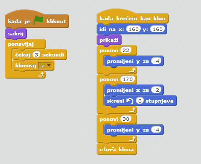

---
title: Dodgeball
level: Scratch 2
language: hr-HR
stylesheet: scratch
embeds: "*.png"
materials: ["Club Leader Resources/*","Project Resources/*"]
...

# Uvod { .intro }

U ovom projektu ćeš naučiti kako kreirati igru u kojoj igrač treba izbjegavati lopte koje se kreću i stići do kraja nivoa.

<div class="scratch-preview">
  <iframe allowtransparency="true" width="485" height="402" src="http://scratch.mit.edu/projects/embed/39740618/?autostart=false" frameborder="0"></iframe>
  
</div>

# Korak 1: Kretanje lika { .activity }

Krenimo kreiranjem lika koji se može kretati lijevo i desno i penjati po preprekama. 

## Zadatci { .check }

+ Otvori novi Scratch projekt i obriši mačku tako da projekt bude prazan. Online Scratch nalazi se na linku: <a href="http://jumpto.cc/scratch-new">jumpto.cc/scratch-new</a>.

+ Za ovaj projekt potrebna ti je mapa 'Project Resources' koja sadrži sliku za pozadinu. Ukoliko ju nemaš, zamoli svog volontera da ti pomogne. 

	

+ Učitaj sliku 'background.png' za pozadinu pozornice (a možeš nacrtati i svoju). Crtaš li svoj nivo, vodi računa o tome da razine i stupovi budu različitih boja, te da su ti potrebna vrata (ili nešto slično) do kojih igrač treba stići. Projekt će izgledati otprilike ovako: 

	

+ Dodaj novog lika. Najbolje bi bilo da odabrani lik ima više kostima, tako da možeš napraviti da izgleda kao da hoda. 

	

+ Upotrijebimo strelice za pomicanje lika po pozornici. Kada igrač pritisne desnu strelicu tvoj lik se treba okrenuti u desno, napraviti nekoliko koraka i promijeniti kostim: 

	```blocks
		kada je ⚑ kliknut
		ponavljaj
   			ako <tipka [strelica desno v] pritisnuta?> onda
      			okreni se u smjeru (90 v)
      			idi (3) koraka
      			sljedeći kostim
   		end
		end
	```

+ Provjeri kreće li se lik tako što ćeš kliknuti na zastavicu i držati pritisnutu desnu strelicu na tipkovnici. Kreće li se tvoj igrač u desno? Izgleda li kao da hoda?

	

+ Za pomicanje lika u lijevo potrebno je unutar petlje `ponavljaj` {.blockcontrol} dodati još jednu naredbu `ako je` {.blockcontrol}. Njome ćeš pokretati lika u lijevo. Ne zaboravi testirati projekt, da se uvjeriš da radi ispravno!  

+ Da se popne na stup, igrač se treba polako pomicati prema gore ako je pritisnuta strelica prema gore, te ako igrač dodiruje ispravnu boju. Dodaj ove naredbe unutar petlje `ponavljaj` {.blockcontrol} :

	```blocks
		ako <<tipka [strelica gore v] pritisnuta?> i <dodiruje boju [#FFFF00]?>> onda
   			promijeni y za (4)
		end

	```

+ Isprobaj penje li se tvoj igrač uz žute stupove i može li doći do kraja razine? 

	

## Spremi projekt { .save }

## Izazov: Dovršavanje nivoa {.challenge}
Možeš li dodati više naredbi svom igraču, tako da on kaže nešto `ako` {.blockcontrol} stigne do smeđih vrata?


## Spremi promjene u projektu { .save }

# Korak 2: Gravitacija i skakanje { .activity }

Dodavanjem gravitacije i omogućavanjem skakanja napravit ćemo da igrač bude još realističniji. 

## Zadatci { .check }

+ Primjeti da se igrač može kretati i po "praznim" dijelovima platforme za igru. Pokušaj ga pokretati po crnim dijelovima i provjeri što se događa. 

	

+ Da bi to popravili, dodajmo u igru gravitaciju. Kreiraj novu varujablu, nazovi ju `gravitacija` {.blockdata}. Slobodno ju sakrij da se ne prikazuje na pozornici. 

	

+ Dodaj sljedeći blok naredbi. Njime ćeš postaviti vrijednost varijable `gravitacija` na negativan broj i to ponavljati kako bi se mijenjala koordinata y igrača.  

	```blocks
		kada je ⚑ kliknut
		postavi [gravitacija v] na [-4]
		ponavljaj
   			promijeni y za (gravitacija)
		end
	```

+ Klikni zastavicu i odvuci igrača na vrh pozornice. Što se događa? Radi li gravitacija očekivano? 

	

+ Gravitacija ne bi trebala pomicati lik kroz platformu ili stup! Dodaj naredbu `ako je` {.blockcontrol} u kôd tako da gravitacija djeluje samo kada je lik u zraku. Kôd za gravitaciju sada treba izgledati ovako: 

	```blocks
		kada je ⚑ kliknut
		postavi [gravitacija v] na [-4]
		ponavljaj
   			ako <nije <<dodiruje boju [#0000FF]?> ili <dodiruje boju [#FFFF00]?>>> onda
      			promijeni y za (gravitacija)
   		end
		end
	```

+ Isprobaj gravitaciju. Zaustavi li se lik kada dodirne platformu ili stup? Test the gravity again. Does your character stop when they are on a platform or a pole? Možeš li sada hodati od ruba platforme do razine ispod?

	

+  Napravimo sada da lik skoči svaki puta kada igrač protisne razmaknicu. Jednostavan način za to je pomicanje lika prema gore nekoliko puta, koristeći naredbe: 

	```blocks
		kada je tipka [razmaknica v] pritisnuta
		ponovi (10)
   		promijeni y za (4)
		end
	```

	Kako gravitacija konstantno vuče lika za 4 piksela dolje trebaš odabrati broj veći od 4 u bloku `promijeni y za (4)` {.blockmotion}. Mijenjaj taj broj sve dok ne budeš zadovoljan skokom. 

+ Isprobaš li sada projekt prijetit ćeš da radi, ali da su pokreti jako spori. Da bi skog izgledao bolje potrebno je pokrete smanjivati postepeno. 

+ Da to napraviš kreiraj još jednu varijablu. Nazovi ju `visina skoka` {.blockdata}. I nju možeš sakriti ako želiš.

+ Obriši naredbe za skakanje lika i zamijeni ih sljedećim naredbama: 

	```blocks
		kada je tipka [razmaknica v] pritisnuta
		postavi [visina skoka v] na [8]
		ponavljaj dok nije <(visina skoka) = [0]>
   		promijeni y za (visina skoka)
   		promijeni [visina skoka v] za (-0.5)
		end
	```

	Ove naredbe pomiću lika za 8 piksela, pa na 7.5, 7, i tako sve dok lik ne završi sa skakanjem. Tako će skok izgledati glađe. 

+ Mijenjaj početnu vrijednost varijable `visina skoka` {.blockdata} i testiraj ju sve dok ne budeš zadovoljan načinom na koji tvoj lik skače. 

## Spremi projekt { .save }

## Izazov: Poboljšaj skakanje {.challenge}
Tvoj lik sada je sposoban skočiti svaki puta kada je pritisnuta razmaknica., čak i kada je u zraku. Isprobaj to držeći razmaknicu pritisnutom. Možeš li to popraviti tako da lik može skakatisamo  `ako` {.blockcontrol} dodiruje plavu platformu?  

## Spremi promjene u projektu { .save }

# Step 3: Dodavanje lopti { .activity .new-page}

Sada kada smo dovršili kretanje lika, dodajmo nekoliko lopti koje treba izbjegavati. 

## Zadatci { .check }

+ Dodaj novi lik - loptu. Odaberi koju želiš. 

	

+ Promijeni veličinu lopte tako da ju tvoj lik može preskočiti. Pokušaj preskočiti loptu da se uvjeriš da je sve u redu. 

	

+ Dodaj sljedeće naredbe lopti: 

	

	One će svake tri sekunde kreirati klona lopte koji će se kretati gornjom platformom. 

+ Klikni na zastavicu i provjeri radi li.

	

+ Dodaj sljedeće naredbe kako bi se lopte kretale kroz sve tri platforme. 

	

+ Na kraju, trebat ćeš naredbe za situaciju u kojoj lik dodirne loptu. Liku lopte dodaj ove naredbe:  

	```blocks
		kada krećem kao klon
		ponavljaj
   			ako <dodiruje [Pico walking v]?> onda
      			pošalji [sudar v]
   		end
		end
	```

+ Također trebaš dodati naredbe svom liku koje će ga vraćati na početak kada dodirne loptu:

	```blocks
		kada primim [sudar v]
		okreni se u smjeru (90 v)
		idi na x:(-210) y:(-120)
	```	

+ Pokreni projekt i provjeri vraća li se lik na početak nakon što se sudari s loptom. 

## Spremi promjene u projektu { .save }

## Izazov: Slučajne lopte {.challenge}
Sve lopte su sada jednake i pojavljuju se svake tri sekunde. Možeš li to poboljšati na način:

+ da ne izgledaju sve lopte jednako?
+ da se ne pojavljuju u isto vrijeme (već nako slučajno odabranog broja sekundi)?
+ da su različitih veličina?


## Spremi promjene u projektu { .save }

# Step 4: Lasers! { .activity .new-page}

Let's make your game a little harder to complete, by adding lasers!

## Activity Checklist { .check }

+ Add a new sprite to your game, called 'Laser'. It should have 2 costumes, called 'on' and 'off'.

	

+ Place your new laser anywhere you like, between 2 platforms.

	

+ Add code to your laser, to make it switch between the 2 costumes.

	```blocks
		when flag clicked
		forever
			switch costume to [on v]
			wait (2) secs
			switch costume to [off v]
			wait (2) secs
		end
	```

	If you prefer, you can `wait` {.blockcontrol} a `random` {.blockoperators} amount of time between costume changes.

+ Finally, add code to your laser, so that the 'hit' message is broadcast when the laser touches your character. This code will be the same as the code you added to your ball sprite.

	You don't need to add any more code to your character - they already know what to do when they get hit!

+ Test out your game to see if you can get past the laser. Change the `wait` {.blockcontrol} times in your code if the lasers are too easy or too hard.

## Challenge: More obstacles {.challenge}
If you think your game is still too easy, you can add more obstacles to your level. You can add anything you like, but here are some ideas:

+ A flying killer butterfly;
+ Platforms that appear and disappear;
+ Falling tennis balls that must be avoided.


You could even create more than one backdrop, and move to the next level when your character reaches the brown door:

```blocks
	if <touching color [#714300]?> then
		switch backdrop to [next backdrop v]
		go to x: (-210) y: (-120)
		wait (1) secs
	end
```

## Save your project { .save }

## Challenge: Improved gravity {.challenge}
There's one other small bug in your game: gravity doesn't pull your character downwards if _any_ part of it is touching a blue platform - even it's head! You can test this out by climbing most of the way up a pole and then moving to the left.


Can you fix this bug? To do this, you need to give your character different coloured trousers (on _all_ costumes)...


...and then replace the code: 

```blocks
	< touching color [#0000FF]? >
```

with:

```blocks
	< color [#00FF00] is touching [#0000FF]? >
```

Remember to test your improvements to make sure you've fixed the bug!

## Save your project { .save }

## Challenge: More lives {.challenge}
Can you give your player 3 `lives` {.blockdata}, instead of just sending them back to the beginning each time? Here's how your game could work:

+ Your player starts with 3 lives;
+ Whenever your player gets hit, one life is lost and they go back to the start;
+ If there are no lives left, the game ends.

## Save your project { .save }
