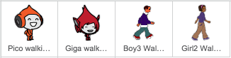
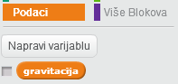
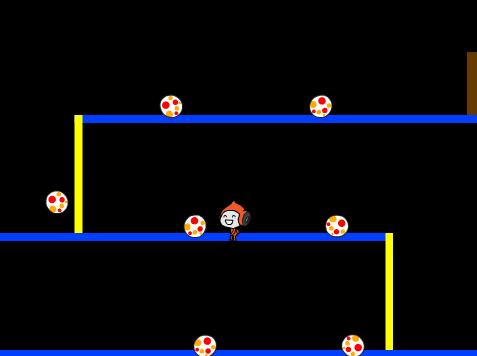

---
title: Dodgeball
level: Scratch 2
language: hr-HR
stylesheet: scratch
embeds: "*.png"
materials: ["Club Leader Resources/*","Project Resources/*"]
...

# Uvod { .intro }

U ovom projektu ćeš naučiti kako kreirati igru u kojoj igrač treba izbjegavati lopte koje se kreću i stići do kraja nivoa.

<div class="scratch-preview">
  <iframe allowtransparency="true" width="485" height="402" src="http://scratch.mit.edu/projects/embed/39740618/?autostart=false" frameborder="0"></iframe>
  
</div>

# Korak 1: Kretanje lika { .activity }

Krenimo kreiranjem lika koji se može kretati lijevo i desno i penjati po preprekama. 

## Zadatci { .check }

+ Otvori novi Scratch projekt i obriši mačku tako da projekt bude prazan. Online Scratch nalazi se na linku: <a href="http://jumpto.cc/scratch-new">jumpto.cc/scratch-new</a>.

+ Za ovaj projekt potrebna ti je mapa 'Project Resources' koja sadrži sliku za pozadinu. Ukoliko ju nemaš, zamoli svog volontera da ti pomogne. 

	

+ Učitaj sliku 'background.png' za pozadinu pozornice (a možeš nacrtati i svoju). Crtaš li svoj nivo, vodi računa o tome da razine i stupovi budu različitih boja, te da su ti potrebna vrata (ili nešto slično) do kojih igrač treba stići. Projekt će izgledati otprilike ovako: 

	

+ Dodaj novog lika. Najbolje bi bilo da odabrani lik ima više kostima, tako da možeš napraviti da izgleda kao da hoda. 

	

+ Upotrijebimo strelice za pomicanje lika po pozornici. Kada igrač pritisne desnu strelicu tvoj lik se treba okrenuti u desno, napraviti nekoliko koraka i promijeniti kostim: 

	```blocks
		kada je ⚑ kliknut
		ponavljaj
   			ako <tipka [strelica desno v] pritisnuta?> onda
      			okreni se u smjeru (90 v)
      			idi (3) koraka
      			sljedeći kostim
   		end
		end
	```

+ Provjeri kreće li se lik tako što ćeš kliknuti na zastavicu i držati pritisnutu desnu strelicu na tipkovnici. Kreće li se tvoj igrač u desno? Izgleda li kao da hoda?

	

+ Za pomicanje lika u lijevo potrebno je unutar petlje `ponavljaj` {.blockcontrol} dodati još jednu naredbu `ako je` {.blockcontrol}. Njome ćeš pokretati lika u lijevo. Ne zaboravi testirati projekt, da se uvjeriš da radi ispravno!  

+ Da se popne na stup, igrač se treba polako pomicati prema gore ako je pritisnuta strelica prema gore, te ako igrač dodiruje ispravnu boju. Dodaj ove naredbe unutar petlje `ponavljaj` {.blockcontrol} :

	```blocks
		ako <<tipka [strelica gore v] pritisnuta?> i <dodiruje boju [#FFFF00]?>> onda
   			promijeni y za (4)
		end

	```

+ Isprobaj penje li se tvoj igrač uz žute stupove i može li doći do kraja razine? 

	

## Spremi projekt { .save }

## Izazov: Dovršavanje nivoa {.challenge}
Možeš li dodati više naredbi svom igraču, tako da on kaže nešto `ako` {.blockcontrol} stigne do smeđih vrata?


## Spremi promjene u projektu { .save }

# Korak 2: Gravitacija i skakanje { .activity }

Dodavanjem gravitacije i omogućavanjem skakanja napravit ćemo da igrač bude još realističniji. 

## Zadatci { .check }

+ Primjeti da se igrač može kretati i po "praznim" dijelovima platforme za igru. Pokušaj ga pokretati po crnim dijelovima i provjeri što se događa. 

	

+ Da bi to popravili, dodajmo u igru gravitaciju. Kreiraj novu varujablu, nazovi ju `gravitacija` {.blockdata}. Slobodno ju sakrij da se ne prikazuje na pozornici. 

	

+ Dodaj sljedeći blok naredbi. Njime ćeš postaviti vrijednost varijable `gravitacija` na negativan broj i to ponavljati kako bi se mijenjala koordinata y igrača.  

	```blocks
		kada je ⚑ kliknut
		postavi [gravitacija v] na [-4]
		ponavljaj
   			promijeni y za (gravitacija)
		end
	```

+ Klikni zastavicu i odvuci igrača na vrh pozornice. Što se događa? Radi li gravitacija očekivano? 

	

+ Gravity shouldn't move your character through a platform or a pole! Add an `if` {.blockcontrol} block to your code, so that the gravity only works when your character is in mid-air. The gravity code should now look like this:

	```blocks
		when flag clicked
		set [gravity v] to [-4]
		forever
			if < not < <touching color [#0000FF]?> or <touching color [#FFFF00]?> > > then
				change y by (gravity)
			end
		end
	```

+ Test the gravity again. Does your character stop when they are on a platform or a pole? Can you walk off the edge of platforms to the level below?

	

+  Let's also make your character jump when the player presses the space bar. One very easy way to do this is to move your character up a few times, using this code:

	```blocks
		when [space v] key pressed
		repeat (10)
			change y by (4)
		end
	```

	As gravity is constantly pushing your character down by 4 pixels, you need to choose a number greater than 4 in your `change y by (4)` {.blockmotion} block. Change this number until you're happy with the height your character jumps.

+ If you test out this code, you'll notice that it works, but the movement isn't very smooth. To make jumping look smoother, you'll need to move your character by smaller and smaller amounts, until they're not jumping anymore.

+ To do this, create another variable called `jump height` {.blockdata}. Again, you can hide this variable if you prefer.

+ Delete the jumping code you added to your character, and replace it with this code:

	```blocks
		when [space v] key pressed
		set [jump height v] to [8]
		repeat until < (jump height) = [0] >
			change y by (jump height)
			change [jump height v] by (-0.5)
		end
	```

	This code moves your character up by 8 pixels, then 7.5 pixels, then 7 pixels, and so on, until your character has finished jumping. This makes jumping look much smoother.

+ Change the starting value of your `jump height` {.blockdata} variable and test it until you're happy with the height your character jumps.

## Save your project { .save }

## Challenge: Improved jumping {.challenge}
Your character is able to jump whenever the spacebar is pressed, even if they're already in mid-air. You can test this by just holding down the spacebar. Can you fix this, so that your character can only jump `if` {.blockcontrol} they're touching a blue platform?

## Save your project { .save }

# Step 3: Dodging balls { .activity .new-page}

Now that you've got your character moving around, let's add some balls for your character to avoid.

## Activity Checklist { .check }

+ Create a new ball sprite. You can choose any type of ball you like.

	

+ Resize your ball, so that your character can jump over it. Try jumping over the ball to test it. 

	

+ Add this code to your ball:

	

	This code creates a new ball clone every 3 seconds. Each new clone moves along the top platform.

+ Click the flag to test this out.

	

+ Add more code to your ball sprite, so that they move across all 3 platforms.

	

+ Finally, you'll need code for when your character gets hit by a ball! Add this code to your ball sprite:

	```blocks
		when I start as a clone
		forever
			if < touching [Pico walking v]? > then
				broadcast [hit v]
			end
		end
	```

+ You'll also need to add code to your character, to move back to the start when they're hit:

	```blocks
		when I receive [hit v]
		point in direction (90 v)
		go to x: (-210) y: (-120)
	```	

+ Test out your character and see if they go back to the start when they've been hit by a ball.

## Save your project { .save }

## Challenge: Random balls {.challenge}
The balls your character has to dodge all look the same, and always appear every 3 seconds. Can you improve them, so that they:

+ don't all look the same?
+ appear after a random amount of time?
+ are a random size?


## Save your project { .save }

# Step 4: Lasers! { .activity .new-page}

Let's make your game a little harder to complete, by adding lasers!

## Activity Checklist { .check }

+ Add a new sprite to your game, called 'Laser'. It should have 2 costumes, called 'on' and 'off'.

	

+ Place your new laser anywhere you like, between 2 platforms.

	

+ Add code to your laser, to make it switch between the 2 costumes.

	```blocks
		when flag clicked
		forever
			switch costume to [on v]
			wait (2) secs
			switch costume to [off v]
			wait (2) secs
		end
	```

	If you prefer, you can `wait` {.blockcontrol} a `random` {.blockoperators} amount of time between costume changes.

+ Finally, add code to your laser, so that the 'hit' message is broadcast when the laser touches your character. This code will be the same as the code you added to your ball sprite.

	You don't need to add any more code to your character - they already know what to do when they get hit!

+ Test out your game to see if you can get past the laser. Change the `wait` {.blockcontrol} times in your code if the lasers are too easy or too hard.

## Challenge: More obstacles {.challenge}
If you think your game is still too easy, you can add more obstacles to your level. You can add anything you like, but here are some ideas:

+ A flying killer butterfly;
+ Platforms that appear and disappear;
+ Falling tennis balls that must be avoided.


You could even create more than one backdrop, and move to the next level when your character reaches the brown door:

```blocks
	if <touching color [#714300]?> then
		switch backdrop to [next backdrop v]
		go to x: (-210) y: (-120)
		wait (1) secs
	end
```

## Save your project { .save }

## Challenge: Improved gravity {.challenge}
There's one other small bug in your game: gravity doesn't pull your character downwards if _any_ part of it is touching a blue platform - even it's head! You can test this out by climbing most of the way up a pole and then moving to the left.


Can you fix this bug? To do this, you need to give your character different coloured trousers (on _all_ costumes)...


...and then replace the code: 

```blocks
	< touching color [#0000FF]? >
```

with:

```blocks
	< color [#00FF00] is touching [#0000FF]? >
```

Remember to test your improvements to make sure you've fixed the bug!

## Save your project { .save }

## Challenge: More lives {.challenge}
Can you give your player 3 `lives` {.blockdata}, instead of just sending them back to the beginning each time? Here's how your game could work:

+ Your player starts with 3 lives;
+ Whenever your player gets hit, one life is lost and they go back to the start;
+ If there are no lives left, the game ends.

## Save your project { .save }
